GOOGLE DATA ANALYTICS PROFESSIONAL CERTIFICATE CAPSTONE PROJECT
================

# INTRODUCTION

The case study below is a part of Google Data Analytics Professional
Certificate program. It covers all six phases of data analysis process:
ask, prepare, process, analyze, share and act. The data used in this
project were provided by course administrator – Google and contains data
and information about fictional bike-share company – Cyclistic. In this
scenario, I am a junior data analyst in Cyclistic marketing analytics
team and were assigned to a new project which should provide insights
that will drive a Cyclistics new marketing strategy.

PRZEROBIONE PRZEZ GPT:

The following case study is a component of the Google Data Analytics
Professional Certificate program. It encompasses all six phases of the
data analysis process: *ask, prepare, process, analyze, share, and act.
The data utilized for this project was furnished by the course
administrator, Google, and consists of data and information pertaining
to the fictional bike-share company, Cyclistic. In this context, I
assume the role of a Junior Data Analyst within Cyclistic’s Marketing
Analytics team, having been tasked with a new project aimed at
delivering insights to inform Cyclistic’s forthcoming marketing
strategy.*

## 1. ASK PHASE

The Cyclistic’s forthcoming marketing strategy will be guided by the
questions below:

1.  How do annual members and casual riders use Cyclistic bikes
    differently?

2.  Why would casual riders buy Cyclistic annual memberships?

3.  How can Cyclistic use digital media to influence casual riders to
    become members?

The director of marketing, Lily Moreno, has assigned me a first question
to answear.

Assigned part of the analytics project will be guided by this business
task:

<u>Pointing habit patterns and behavior differences in casual and annual
Cyclistic user groups.</u>

## 2. PREPARE PHASE

Used data comes internal from Cyclistic system. It is organized in csv
files – each file contains quantitative set of data for each month and
it covers whole year 2022. Data does not contain any personal
information about the users and can not be connected with any specific
one. One row contain data about one ride taken by user.

Since it is every ride data and it is collected automatically, it is
free of observer, sampling and confirmation bias. It also fulfills the
conditions of good data (it is reliable, original, comprehensive,
current and cited). Data’s licensing, privacy, security and
accessibility are specified in Data License Agreement available under
<https://divvybikes.com/data-license-agreement> site.

Problems with provided data that could create problems during the
analysis:

- *The amount of rides make it impossible to analyze a full year view in
  one spreadsheet.*

- *The start and end station names are not always provided.*

- *The start and end station names are not consistent. Further analysis
  showed that there is difference between number of station id’s and
  station names (same stations – by id - are sometimes named
  differently).*

- *The latitude and longitude of stations does not always have same
  accuracy (differences in decimal places) but is 100% complete.
  However, according to provided information, coordinates are not used
  in this analysis project .*

- *Because data is anonymized, it is impossible to link ride with user
  and analyze his ride history.*

## 3. PROCESS PHASE

For initial cleaning and manipulating purposes Excel spreadsheet and
Excel’s Power Query tool were used. Since the amount of data is too big
to be analyzed in one spreadsheet (5 667 711 rows), each file have been
checked, cleaned and transformed separately.

Cleaning details:

<table>
<thead>
  <tr>
    <th>Column(s)<br></th>
    <th>Action</th>
  </tr>
</thead>
<tbody>
  <tr style="text-align: center;">
    <td colspan="2">STEPS IN EXCEL POWER QUERY TOOL</td>
  </tr>
  <tr>
    <td>all</td>
    <td>Checking if all columns have the right data type; changed where necessary.</td>
  </tr>
  <tr>
    <td>member_casual</td>
    <td>Changing column name to customer_type for clarity.</td>
  </tr>
  <tr>
    <td>started_at,<br>started_at_hour</td>
    <td>Duplicating started_at column and extracting new started_at_hour column from it, needed in further analysis</td>
  </tr>
  <tr>
    <td>Started_at_hour_as_num</td>
    <td>Adding new started_at_hour_as_num column to convert ‘started_at_hour’ values into number (decimal) data type; needed in further analysis.</td>
  </tr>
  <tr>
    <td>ride_id_len</td>
    <td>Adding new ride_id_len column for checking if hashed ride_id length is consistent (every ride_id_len should be 16 characters long).<br>Used formula: =Text.Length([ride_id])<br></td>
  </tr>
  <tr>
    <td>ride_len</td>
    <td>Adding new ride_len column with subtracted ‘ended_at’ and ‘started_at’ columns for calculating each ride length time.<br>Used formula: =[ended_at]-[started_at]</td>
  </tr>
  <tr>
    <td>start_day_of_week</td>
    <td>Adding new start_day_of_week column for extracting day of week when ride started.<br>Note: 1 = Monday, …, 7 = Sunday<br>Used formula: =Date.DayOfWeek([started_at]) + 1</td>
  </tr>
  <tr>
    <td colspan="2">STEPS IN EXCEL</td>
  </tr>
  <tr>
    <td>all</td>
    <td>Remove duplicates tool for checking duplicated rows</td>
  </tr>
  <tr>
    <td>ridealble_type, customer_type</td>
    <td>Filtering tool for checking distinct values.</td>
  </tr>
  <tr>
    <td>all</td>
    <td>Checking for null values.<br>Note: despite null values in some ‘start_station_name’, ‘start_station_id’, ‘end_station_name’ and ‘end_station_id’ rows, these are removed only if at least one of four coordinates (start_lat, start_lng, end_lat, end_lng) is missing.<br></td>
  </tr>
  <tr>
    <td>start_lat, start_lng, end_lat, end_lng</td>
    <td>Checking if values are in appropriate coordinates range; delete where necessary.</td>
  </tr>
  <tr>
    <td>started_part_of_day</td>
    <td>Creating nested =IF() function for defining new parameter – part of the day when the ride started - in new column.<br>Note:<br>Morning = 6:00 AM to 12:00 PM<br>Afternoon = 12:01 PM to 5:59 PM<br>Evening = 6:00 PM to 11:59 PM<br>Night = 12:00 AM to 5:59 AM<br>Used formula: =IF([@[started_at_hour_as_num]]&gt;0,74999;"Evening";IF([@[started_at_hour_as_num]]&gt;0,5;"Afternoon";IF([@[started_at_hour_as_num]]&gt;0,166655;"Morning";"Night"))<br></td>
  </tr>
  <tr>
    <td>Ride_len</td>
    <td>Checking values.<br>According to provided information, casual members are those who purchase single-ride or full-day passes. Since there is no any additional information, all rides where:<br>•    ride_len &gt; 1.00:00:00 (24 hours)<br>AND<br>•    customer_type = casual<br>are filtered out.<br><br>Hypothesis: all rides up to 0.00:00:10 (10 seconds) may be indicator of some rent issuses, user plans change etc. Initial test (if start coordinates are equal to end coordinates) showed that the overwhelming majority of short (&lt; 10 sec) rides are starting and ending at the same station.<br>Final confirmation or rejection of this hypothesis needs some more information from the company. <br>Having regard to the above, as a safe solution, all rides shorter than 11 seconds were filtered out.<br></td>
  </tr>
</tbody>
</table>

Rows deleted during cleaning:

<table class="tg">
<thead>
  <tr>
    <th class="tg-c3ow" rowspan="2"></th>
    <th class="tg-c3ow" colspan="2">start_lat</th>
    <th class="tg-c3ow" colspan="2">start_lng</th>
    <th class="tg-c3ow" colspan="2">end_lat</th>
    <th class="tg-c3ow" colspan="2">end_lng</th>
    <th class="tg-c3ow" rowspan="2">Ride_len &gt; 24 h<br>AND<br>Customer_type = casual</th>
    <th class="tg-c3ow" rowspan="2">&nbsp;&nbsp;&nbsp;<br>Ride_len &lt; 10 sec&nbsp;&nbsp;&nbsp;</th>
  </tr>
  <tr>
    <th class="tg-c3ow">Values out of proper range</th>
    <th class="tg-c3ow">nulls</th>
    <th class="tg-c3ow">Values out of proper range</th>
    <th class="tg-c3ow">nulls</th>
    <th class="tg-c3ow">Values out of proper range</th>
    <th class="tg-c3ow">nulls</th>
    <th class="tg-c3ow">Values out of proper range</th>
    <th class="tg-c3ow">nulls</th>
  </tr>
</thead>
<tbody>
  <tr>
    <td class="tg-c3ow">January</td>
    <td class="tg-c3ow"></td>
    <td class="tg-c3ow"></td>
    <td class="tg-c3ow">1</td>
    <td class="tg-c3ow"></td>
    <td class="tg-c3ow"></td>
    <td class="tg-c3ow">&nbsp;&nbsp;&nbsp;<br>86&nbsp;&nbsp;&nbsp;</td>
    <td class="tg-c3ow"></td>
    <td class="tg-c3ow"></td>
    <td class="tg-c3ow">19</td>
    <td class="tg-c3ow">550</td>
  </tr>
  <tr>
    <td class="tg-c3ow">February</td>
    <td class="tg-c3ow"></td>
    <td class="tg-c3ow"></td>
    <td class="tg-c3ow"></td>
    <td class="tg-c3ow"></td>
    <td class="tg-c3ow"></td>
    <td class="tg-c3ow">&nbsp;&nbsp;&nbsp;<br>77&nbsp;&nbsp;&nbsp;</td>
    <td class="tg-c3ow"></td>
    <td class="tg-c3ow"></td>
    <td class="tg-c3ow">65</td>
    <td class="tg-c3ow">907</td>
  </tr>
  <tr>
    <td class="tg-c3ow">March</td>
    <td class="tg-c3ow"></td>
    <td class="tg-c3ow"></td>
    <td class="tg-c3ow"></td>
    <td class="tg-c3ow"></td>
    <td class="tg-c3ow"></td>
    <td class="tg-c3ow">&nbsp;&nbsp;&nbsp;<br>266&nbsp;&nbsp;&nbsp;</td>
    <td class="tg-c3ow"></td>
    <td class="tg-c3ow"></td>
    <td class="tg-c3ow">42</td>
    <td class="tg-c3ow">1470</td>
  </tr>
  <tr>
    <td class="tg-c3ow">April</td>
    <td class="tg-c3ow"></td>
    <td class="tg-c3ow"></td>
    <td class="tg-c3ow"></td>
    <td class="tg-c3ow"></td>
    <td class="tg-c3ow"></td>
    <td class="tg-c3ow">&nbsp;&nbsp;&nbsp;<br>317&nbsp;&nbsp;&nbsp;</td>
    <td class="tg-c3ow"></td>
    <td class="tg-c3ow"></td>
    <td class="tg-c3ow">11</td>
    <td class="tg-c3ow">2513</td>
  </tr>
  <tr>
    <td class="tg-c3ow">May</td>
    <td class="tg-c3ow"></td>
    <td class="tg-c3ow"></td>
    <td class="tg-c3ow"></td>
    <td class="tg-c3ow"></td>
    <td class="tg-c3ow"></td>
    <td class="tg-c3ow">&nbsp;&nbsp;&nbsp;<br>722&nbsp;&nbsp;&nbsp;</td>
    <td class="tg-c3ow"></td>
    <td class="tg-c3ow"></td>
    <td class="tg-c3ow">15</td>
    <td class="tg-c3ow">3307</td>
  </tr>
  <tr>
    <td class="tg-c3ow">June</td>
    <td class="tg-c3ow"></td>
    <td class="tg-c3ow"></td>
    <td class="tg-c3ow"></td>
    <td class="tg-c3ow"></td>
    <td class="tg-c3ow"></td>
    <td class="tg-c3ow">&nbsp;&nbsp;&nbsp;<br>1055&nbsp;&nbsp;&nbsp;</td>
    <td class="tg-c3ow"></td>
    <td class="tg-c3ow"></td>
    <td class="tg-c3ow">11</td>
    <td class="tg-c3ow">3619</td>
  </tr>
  <tr>
    <td class="tg-c3ow">July</td>
    <td class="tg-c3ow"></td>
    <td class="tg-c3ow"></td>
    <td class="tg-c3ow"></td>
    <td class="tg-c3ow"></td>
    <td class="tg-c3ow"></td>
    <td class="tg-c3ow">&nbsp;&nbsp;&nbsp;<br>947&nbsp;&nbsp;&nbsp;</td>
    <td class="tg-c3ow"></td>
    <td class="tg-c3ow"></td>
    <td class="tg-c3ow">21</td>
    <td class="tg-c3ow">3844</td>
  </tr>
  <tr>
    <td class="tg-c3ow">August</td>
    <td class="tg-c3ow"></td>
    <td class="tg-c3ow"></td>
    <td class="tg-c3ow"></td>
    <td class="tg-c3ow"></td>
    <td class="tg-c3ow"></td>
    <td class="tg-c3ow">&nbsp;&nbsp;&nbsp;<br>843&nbsp;&nbsp;&nbsp;</td>
    <td class="tg-c3ow"></td>
    <td class="tg-c3ow"></td>
    <td class="tg-c3ow">9</td>
    <td class="tg-c3ow">3889</td>
  </tr>
  <tr>
    <td class="tg-c3ow">September</td>
    <td class="tg-c3ow"></td>
    <td class="tg-c3ow"></td>
    <td class="tg-c3ow"></td>
    <td class="tg-c3ow"></td>
    <td class="tg-c3ow"></td>
    <td class="tg-c3ow">&nbsp;&nbsp;&nbsp;<br>712&nbsp;&nbsp;&nbsp;</td>
    <td class="tg-c3ow"></td>
    <td class="tg-c3ow"></td>
    <td class="tg-c3ow">7</td>
    <td class="tg-c3ow">3162</td>
  </tr>
  <tr>
    <td class="tg-c3ow">October</td>
    <td class="tg-c3ow"></td>
    <td class="tg-c3ow"></td>
    <td class="tg-c3ow"></td>
    <td class="tg-c3ow"></td>
    <td class="tg-c3ow"></td>
    <td class="tg-c3ow">&nbsp;&nbsp;&nbsp;<br>475&nbsp;&nbsp;&nbsp;</td>
    <td class="tg-c3ow"></td>
    <td class="tg-c3ow"></td>
    <td class="tg-c3ow">8</td>
    <td class="tg-c3ow">2834</td>
  </tr>
  <tr>
    <td class="tg-c3ow">November</td>
    <td class="tg-c3ow"></td>
    <td class="tg-c3ow"></td>
    <td class="tg-c3ow"></td>
    <td class="tg-c3ow"></td>
    <td class="tg-c3ow"></td>
    <td class="tg-c3ow">&nbsp;&nbsp;&nbsp;<br>238&nbsp;&nbsp;&nbsp;</td>
    <td class="tg-c3ow"></td>
    <td class="tg-c3ow"></td>
    <td class="tg-c3ow">5</td>
    <td class="tg-c3ow">1822</td>
  </tr>
  <tr>
    <td class="tg-c3ow">December</td>
    <td class="tg-c3ow"></td>
    <td class="tg-c3ow"></td>
    <td class="tg-c3ow"></td>
    <td class="tg-c3ow"></td>
    <td class="tg-c3ow"></td>
    <td class="tg-c3ow">&nbsp;&nbsp;&nbsp;<br>128&nbsp;&nbsp;&nbsp;</td>
    <td class="tg-c3ow"></td>
    <td class="tg-c3ow"></td>
    <td class="tg-c3ow">3</td>
    <td class="tg-c3ow">1268</td>
  </tr>
  <tr>
    <td class="tg-baqh">TOTAL</td>
    <td class="tg-baqh"></td>
    <td class="tg-baqh"></td>
    <td class="tg-baqh">1</td>
    <td class="tg-baqh"></td>
    <td class="tg-baqh"></td>
    <td class="tg-baqh">5866</td>
    <td class="tg-baqh"></td>
    <td class="tg-baqh"></td>
    <td class="tg-baqh">216</td>
    <td class="tg-baqh">29185</td>
  </tr>
</tbody>
</table>

Cleaning process reduced number of rows by 0,62%; total number of
deleted rows = 35268.

Data manipulation increased number of columns from 13 to 19. New data
columns:

- started_at_hour - hour when ride started,

- started_at_hour_as_num - hour when hour started presented as number
  data type,

- start_id_len - length of hashed ride_id,

- ride_len - length of ride,

- start_day_of_week - day of week when ride started,

- started_at_part_of_day - part of day when ride started.

After cleaning and manipulating, each file was saved as csv file (for
analysis in R Studio, Big Query SQL and Tableau visualizations) and xlsx
file. In each months xlxs file new pivot table sheet with cleaned and
manipulated data were created.

## 4. ANALYZE PHASE

Like mentioned above, the number of rows is too big to store and analyze
data in one spreadsheet, so data have been imported into R Studio.

### DATA IMPORT AND BIND

``` r
jan_2022_data <- read.csv("D:/GDAPC Case study/01_Bike_share/cleaned_in_excel/csv/012022_tripdata.csv", sep = ';')
feb_2022_data <- read.csv("D:/GDAPC Case study/01_Bike_share/cleaned_in_excel/csv/022022_tripdata.csv", sep = ';')
mar_2022_data <- read.csv("D:/GDAPC Case study/01_Bike_share/cleaned_in_excel/csv/032022_tripdata.csv", sep = ';')
apr_2022_data <- read.csv("D:/GDAPC Case study/01_Bike_share/cleaned_in_excel/csv/042022_tripdata.csv", sep = ';')
may_2022_data <- read.csv("D:/GDAPC Case study/01_Bike_share/cleaned_in_excel/csv/052022_tripdata.csv", sep = ';')
jun_2022_data <- read.csv("D:/GDAPC Case study/01_Bike_share/cleaned_in_excel/csv/062022_tripdata.csv", sep = ';')
jul_2022_data <- read.csv("D:/GDAPC Case study/01_Bike_share/cleaned_in_excel/csv/072022_tripdata.csv", sep = ';')
aug_2022_data <- read.csv("D:/GDAPC Case study/01_Bike_share/cleaned_in_excel/csv/082022_tripdata.csv", sep = ';')
sep_2022_data <- read.csv("D:/GDAPC Case study/01_Bike_share/cleaned_in_excel/csv/092022_tripdata.csv", sep = ';')
oct_2022_data <- read.csv("D:/GDAPC Case study/01_Bike_share/cleaned_in_excel/csv/102022_tripdata.csv", sep = ';')
nov_2022_data <- read.csv("D:/GDAPC Case study/01_Bike_share/cleaned_in_excel/csv/112022_tripdata.csv", sep = ';')
dec_2022_data <- read.csv("D:/GDAPC Case study/01_Bike_share/cleaned_in_excel/csv/122022_tripdata.csv", sep = ';')
```

``` r
all_2022_data <- rbind(jan_2022_data, feb_2022_data, mar_2022_data, apr_2022_data,
                       may_2022_data, jun_2022_data, jul_2022_data, aug_2022_data,
                       sep_2022_data, oct_2022_data, nov_2022_data, dec_2022_data)
```

## INITIAL DATA CHECK

``` r
library(dplyr)

glimpse(all_2022_data)
```

    ## Rows: 5,632,443
    ## Columns: 19
    ## $ ride_id                <chr> "94696E127B0B5C2E", "2F30091C42C1A659", "FFF47E…
    ## $ rideable_type          <chr> "classic_bike", "classic_bike", "classic_bike",…
    ## $ started_at             <chr> "01.01.2022 09:22", "10.01.2022 07:15", "24.01.…
    ## $ ended_at               <chr> "02.01.2022 10:22", "11.01.2022 08:15", "25.01.…
    ## $ start_station_name     <chr> "Millennium Park", "Sheffield Ave & Waveland Av…
    ## $ start_station_id       <chr> "13008", "TA1307000126", "KA1503000071", "WL-00…
    ## $ end_station_name       <chr> "", "", "Lake Park Ave & 56th St", "Michigan Av…
    ## $ end_station_id         <chr> "", "", "TA1309000063", "TA1307000124", "", "",…
    ## $ start_lat              <dbl> 41.88103, 41.94940, 41.79148, 41.86712, 41.9394…
    ## $ start_lng              <dbl> -87.62408, -87.65453, -87.59986, -87.64109, -87…
    ## $ end_lat                <dbl> 41.87000, 41.94000, 41.79324, 41.86406, 41.9400…
    ## $ end_lng                <dbl> -87.63000, -87.66000, -87.58778, -87.62373, -87…
    ## $ customer_type          <chr> "member", "member", "member", "casual", "member…
    ## $ started_at_hour        <chr> "09:22:49", "07:15:21", "12:25:04", "11:34:32",…
    ## $ started_at_hour_as_num <dbl> 0.3908449, 0.3023264, 0.5174074, 0.4823148, 0.4…
    ## $ ride_id_len            <int> 16, 16, 16, 16, 16, 16, 16, 16, 16, 16, 16, 16,…
    ## $ ride_len               <chr> "24:59:55", "24:59:52", "23:00:00", "22:59:37",…
    ## $ start_day_of_week      <int> 6, 1, 1, 1, 7, 7, 5, 1, 4, 4, 3, 1, 7, 7, 4, 2,…
    ## $ started_at_part_of_day <chr> "Morning", "Morning", "Afternoon", "Morning", "…

``` r
library(skimr)

skim_without_charts(all_2022_data)
```

|                                                  |               |
|:-------------------------------------------------|:--------------|
| Name                                             | all_2022_data |
| Number of rows                                   | 5632443       |
| Number of columns                                | 19            |
| \_\_\_\_\_\_\_\_\_\_\_\_\_\_\_\_\_\_\_\_\_\_\_   |               |
| Column type frequency:                           |               |
| character                                        | 12            |
| numeric                                          | 7             |
| \_\_\_\_\_\_\_\_\_\_\_\_\_\_\_\_\_\_\_\_\_\_\_\_ |               |
| Group variables                                  | None          |

Data summary

**Variable type: character**

| skim_variable          | n_missing | complete_rate | min | max |  empty | n_unique | whitespace |
|:-----------------------|----------:|--------------:|----:|----:|-------:|---------:|-----------:|
| ride_id                |         0 |          1.00 |  16 |  16 |      0 |  5632443 |          0 |
| rideable_type          |         0 |          1.00 |  11 |  13 |      0 |        3 |          0 |
| started_at             |         0 |          1.00 |  16 |  16 |      0 |   456257 |          0 |
| ended_at               |         0 |          1.00 |  16 |  16 |      0 |   456579 |          0 |
| start_station_name     |         0 |          1.00 |   0 |  64 | 826139 |     1675 |          0 |
| start_station_id       |         0 |          1.00 |   0 |  44 | 826139 |     1314 |          0 |
| end_station_name       |         0 |          1.00 |   0 |  64 | 876410 |     1691 |          0 |
| end_station_id         |    895121 |          0.84 |   0 |  44 | 668824 |     1318 |          0 |
| customer_type          |         0 |          1.00 |   6 |   6 |      0 |        2 |          0 |
| started_at_hour        |         0 |          1.00 |   8 |   8 |      0 |    86341 |          0 |
| ride_len               |         0 |          1.00 |   7 |  10 |      0 |    24423 |          0 |
| started_at_part_of_day |         0 |          1.00 |   5 |   9 |      0 |        4 |          0 |

**Variable type: numeric**

| skim_variable          | n_missing | complete_rate |   mean |   sd |     p0 |    p25 |    p50 |    p75 |   p100 |
|:-----------------------|----------:|--------------:|-------:|-----:|-------:|-------:|-------:|-------:|-------:|
| start_lat              |         0 |             1 |  41.90 | 0.05 |  41.64 |  41.88 |  41.90 |  41.93 |  45.64 |
| start_lng              |         0 |             1 | -87.65 | 0.03 | -87.84 | -87.66 | -87.64 | -87.63 | -73.80 |
| end_lat                |         0 |             1 |  41.90 | 0.05 |  41.55 |  41.88 |  41.90 |  41.93 |  42.37 |
| end_lng                |         0 |             1 | -87.65 | 0.03 | -88.14 | -87.66 | -87.64 | -87.63 | -87.30 |
| started_at_hour_as_num |         0 |             1 |   0.61 | 0.21 |   0.00 |   0.48 |   0.65 |   0.76 |   1.00 |
| ride_id_len            |         0 |             1 |  16.00 | 0.00 |  16.00 |  16.00 |  16.00 |  16.00 |  16.00 |
| start_day_of_week      |         0 |             1 |   4.06 | 1.98 |   1.00 |   2.00 |   4.00 |   6.00 |   7.00 |

All data was imported and binded properly and it is organized in 5 632
443 rows and 19 columns, all rows complete_rate is equal to 1 (which
indicates that it is 100% complete). Except end_station_id row
(complete_rate = 0,841), the reason of that was mentioned before.

Completion rate and consistency of min and max values of ride_id row
shows positive evaluation throughout the whole dataset. Data frame above
shows additionally that number of start_station_names/end_station_names
and start_station_ids/end_station_ids are not equal what confirms
assumption made while data cleaning.

Data check showed that started_at, ended_at and ride_len columns were
imported as characters instead of datetime and duration data types. So
it needs to be changed. Because manipulating and making calculations on
ride_len in numeric data type is easier, I decided to keep it this way.

## DATA TYPES CHANGE

``` r
library(tidyverse)
library(lubridate)

all_2022_data <- all_2022_data %>% 
  mutate(
    started_at = as_datetime(started_at, format = '%d.%m.%Y %H:%M'),
    ended_at = as_datetime(ended_at, format = '%d.%m.%Y %H:%M'),
    ride_len = as.numeric(difftime(ended_at, started_at, units = 'min'))
         )

glimpse(all_2022_data)
```

    ## Rows: 5,632,443
    ## Columns: 19
    ## $ ride_id                <chr> "94696E127B0B5C2E", "2F30091C42C1A659", "FFF47E…
    ## $ rideable_type          <chr> "classic_bike", "classic_bike", "classic_bike",…
    ## $ started_at             <dttm> 2022-01-01 09:22:00, 2022-01-10 07:15:00, 2022…
    ## $ ended_at               <dttm> 2022-01-02 10:22:00, 2022-01-11 08:15:00, 2022…
    ## $ start_station_name     <chr> "Millennium Park", "Sheffield Ave & Waveland Av…
    ## $ start_station_id       <chr> "13008", "TA1307000126", "KA1503000071", "WL-00…
    ## $ end_station_name       <chr> "", "", "Lake Park Ave & 56th St", "Michigan Av…
    ## $ end_station_id         <chr> "", "", "TA1309000063", "TA1307000124", "", "",…
    ## $ start_lat              <dbl> 41.88103, 41.94940, 41.79148, 41.86712, 41.9394…
    ## $ start_lng              <dbl> -87.62408, -87.65453, -87.59986, -87.64109, -87…
    ## $ end_lat                <dbl> 41.87000, 41.94000, 41.79324, 41.86406, 41.9400…
    ## $ end_lng                <dbl> -87.63000, -87.66000, -87.58778, -87.62373, -87…
    ## $ customer_type          <chr> "member", "member", "member", "casual", "member…
    ## $ started_at_hour        <chr> "09:22:49", "07:15:21", "12:25:04", "11:34:32",…
    ## $ started_at_hour_as_num <dbl> 0.3908449, 0.3023264, 0.5174074, 0.4823148, 0.4…
    ## $ ride_id_len            <int> 16, 16, 16, 16, 16, 16, 16, 16, 16, 16, 16, 16,…
    ## $ ride_len               <dbl> 1500, 1500, 1380, 1380, 1378, 1346, 1321, 1270,…
    ## $ start_day_of_week      <int> 6, 1, 1, 1, 7, 7, 5, 1, 4, 4, 3, 1, 7, 7, 4, 2,…
    ## $ started_at_part_of_day <chr> "Morning", "Morning", "Afternoon", "Morning", "…

\##PLIK DO TABLEAU

``` r
all_2022_data_R_for_Tableau <- select(all_2022_data, ride_id, rideable_type, started_at, ended_at, start_lat, start_lng, end_lat, end_lng, customer_type, ride_len, started_at_part_of_day)

write.csv2(all_2022_data_R_for_Tableau, file = 'D:/GDAPC Case study/01_Bike_share/all_2022_data_R_for_Tableau.csv')
```

As all data were merged into one file, additional month column will be
needed for analysis:

## ADDITIONAL COLUMNS FOR CALCS AND VIZ

``` r
all_2022_data <- all_2022_data %>% 
  mutate(month = substr(started_at, 6, 7)
        )

glimpse(all_2022_data)
```

    ## Rows: 5,632,443
    ## Columns: 20
    ## $ ride_id                <chr> "94696E127B0B5C2E", "2F30091C42C1A659", "FFF47E…
    ## $ rideable_type          <chr> "classic_bike", "classic_bike", "classic_bike",…
    ## $ started_at             <dttm> 2022-01-01 09:22:00, 2022-01-10 07:15:00, 2022…
    ## $ ended_at               <dttm> 2022-01-02 10:22:00, 2022-01-11 08:15:00, 2022…
    ## $ start_station_name     <chr> "Millennium Park", "Sheffield Ave & Waveland Av…
    ## $ start_station_id       <chr> "13008", "TA1307000126", "KA1503000071", "WL-00…
    ## $ end_station_name       <chr> "", "", "Lake Park Ave & 56th St", "Michigan Av…
    ## $ end_station_id         <chr> "", "", "TA1309000063", "TA1307000124", "", "",…
    ## $ start_lat              <dbl> 41.88103, 41.94940, 41.79148, 41.86712, 41.9394…
    ## $ start_lng              <dbl> -87.62408, -87.65453, -87.59986, -87.64109, -87…
    ## $ end_lat                <dbl> 41.87000, 41.94000, 41.79324, 41.86406, 41.9400…
    ## $ end_lng                <dbl> -87.63000, -87.66000, -87.58778, -87.62373, -87…
    ## $ customer_type          <chr> "member", "member", "member", "casual", "member…
    ## $ started_at_hour        <chr> "09:22:49", "07:15:21", "12:25:04", "11:34:32",…
    ## $ started_at_hour_as_num <dbl> 0.3908449, 0.3023264, 0.5174074, 0.4823148, 0.4…
    ## $ ride_id_len            <int> 16, 16, 16, 16, 16, 16, 16, 16, 16, 16, 16, 16,…
    ## $ ride_len               <dbl> 1500, 1500, 1380, 1380, 1378, 1346, 1321, 1270,…
    ## $ start_day_of_week      <int> 6, 1, 1, 1, 7, 7, 5, 1, 4, 4, 3, 1, 7, 7, 4, 2,…
    ## $ started_at_part_of_day <chr> "Morning", "Morning", "Afternoon", "Morning", "…
    ## $ month                  <chr> "01", "01", "01", "01", "01", "01", "01", "01",…

## SUMMARY OF DATA BEFORE CALCS

``` r
all_2022_data_summary <- all_2022_data %>%
  group_by(customer_type, month, rideable_type) %>% 
  summarise(
    num_of_rides = n(),
    mean_ride_len = mean(ride_len),
    mode_of_day_of_week = median(start_day_of_week),
    mode_of_part_of_day = names(sort(table(started_at_part_of_day), decreasing = TRUE)[1]),
    )

glimpse(all_2022_data_summary)
```

    ## Rows: 60
    ## Columns: 7
    ## Groups: customer_type, month [24]
    ## $ customer_type       <chr> "casual", "casual", "casual", "casual", "casual", …
    ## $ month               <chr> "01", "01", "01", "02", "02", "02", "03", "03", "0…
    ## $ rideable_type       <chr> "classic_bike", "docked_bike", "electric_bike", "c…
    ## $ num_of_rides        <int> 6909, 925, 10460, 8042, 1330, 11823, 35190, 8176, …
    ## $ mean_ride_len       <dbl> 21.59357, 36.97838, 12.86128, 23.73066, 44.74962, …
    ## $ mode_of_day_of_week <dbl> 4, 5, 4, 4, 5, 4, 4, 4, 4, 6, 6, 5, 5, 5, 4, 5, 5,…
    ## $ mode_of_part_of_day <chr> "Afternoon", "Afternoon", "Afternoon", "Afternoon"…

Summary above showed that all subgroups rides mode_of_part_of_day =
‘Afternoon’ so adding a new column with full hour when ride started
could be usefull in further analysis:

``` r
all_2022_data <- all_2022_data %>% 
  mutate(started_at_full_hour = substr(started_at_hour, 1, 2))
```

## FINAL DF SUMMARY OF DATA BEFORE CALCS

``` r
all_2022_data_summary <- all_2022_data %>%
  group_by(customer_type, month, rideable_type, start_day_of_week, started_at_part_of_day, started_at_full_hour) %>% 
  summarise(
    num_of_rides = n(),
    mean_ride_len = mean(ride_len)
            )

glimpse(all_2022_data_summary)
```

    ## Rows: 10,078
    ## Columns: 8
    ## Groups: customer_type, month, rideable_type, start_day_of_week, started_at_part_of_day [1,680]
    ## $ customer_type          <chr> "casual", "casual", "casual", "casual", "casual…
    ## $ month                  <chr> "01", "01", "01", "01", "01", "01", "01", "01",…
    ## $ rideable_type          <chr> "classic_bike", "classic_bike", "classic_bike",…
    ## $ start_day_of_week      <int> 1, 1, 1, 1, 1, 1, 1, 1, 1, 1, 1, 1, 1, 1, 1, 1,…
    ## $ started_at_part_of_day <chr> "Afternoon", "Afternoon", "Afternoon", "Afterno…
    ## $ started_at_full_hour   <chr> "12", "13", "14", "15", "16", "17", "18", "19",…
    ## $ num_of_rides           <int> 55, 48, 74, 55, 92, 89, 71, 56, 25, 22, 26, 11,…
    ## $ mean_ride_len          <dbl> 27.400000, 49.333333, 47.837838, 23.145455, 19.…

The data summary above will be used for all future calculations and
visualizations in R.

- Number of rides by customer type:

``` r
library(knitr)

all_2022_data_rides <- all_2022_data %>%
  group_by(customer_type) %>% 
  summarise(num_of_rides = n())

kable(all_2022_data_rides)
```

| customer_type | num_of_rides |
|:--------------|-------------:|
| casual        |      2305885 |
| member        |      3326558 |

``` r
library(ggplot2)
library(RColorBrewer)

ggplot(all_2022_data_summary, aes(x = customer_type, y = num_of_rides, fill = customer_type)) + 
  geom_col(show.legend = FALSE) + 
  labs(x = 'Customer type', y = 'Number of rides', title = 'Numer of rides performed', subtitle = 'by customer type', caption = 'Source: Cyclistic bike-share system 2022 data') + 
  scale_y_continuous(labels = scales::comma) +
  scale_fill_brewer(palette = 'Set1') +
  theme_light()
```
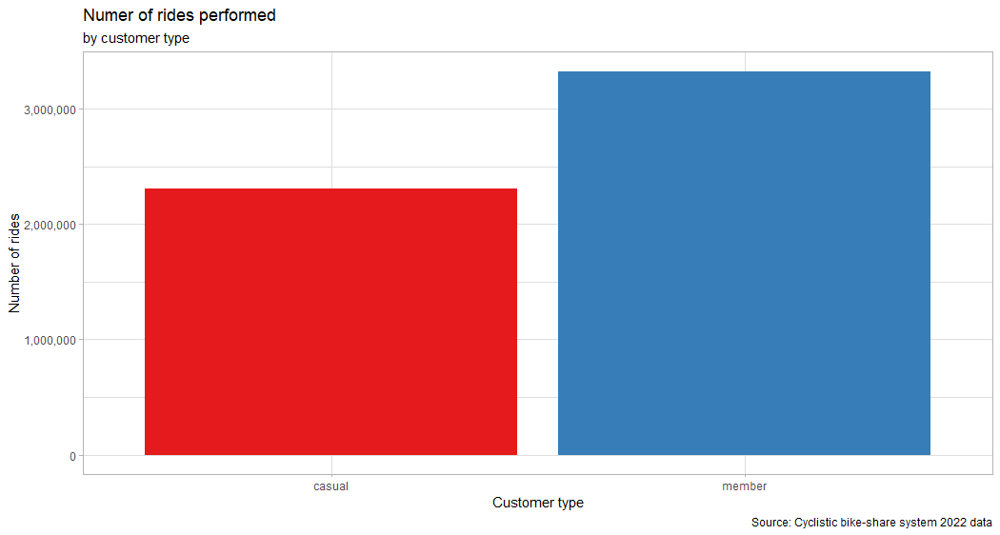

- Number of rides by customer type by each month

``` r
all_2022_data_rides <- all_2022_data %>%
  group_by(customer_type, month) %>% 
  summarise(num_of_rides = n()) %>% 
  arrange(-num_of_rides)

kable(all_2022_data_rides)
```

| customer_type | month | num_of_rides |
|:--------------|:------|-------------:|
| member        | 08    |       424710 |
| member        | 07    |       415244 |
| casual        | 07    |       403433 |
| member        | 09    |       402600 |
| member        | 06    |       398001 |
| casual        | 06    |       366519 |
| casual        | 08    |       356481 |
| member        | 05    |       352428 |
| member        | 10    |       347690 |
| casual        | 09    |       294858 |
| casual        | 05    |       278387 |
| member        | 04    |       243084 |
| member        | 11    |       235645 |
| casual        | 10    |       207678 |
| member        | 03    |       193069 |
| member        | 12    |       135916 |
| casual        | 04    |       125325 |
| casual        | 11    |       100025 |
| member        | 02    |        93417 |
| casual        | 03    |        89196 |
| member        | 01    |        84754 |
| casual        | 12    |        44494 |
| casual        | 02    |        21195 |
| casual        | 01    |        18294 |

``` r
ggplot(all_2022_data_summary, aes(x = customer_type, y = num_of_rides, fill = customer_type)) + 
  geom_col() +
  facet_grid(~month, labeller = labeller(month = c(
    "01" = "January",
    "02" = "February",
    "03" = "March",
    "04" = "April",
    "05" = "May",
    "06" = "June",
    "07" = "July",
    "08" = "August",
    "09" = "September",
    "10" = "October",
    "11" = "November",
    "12" = "December"))) +
  scale_y_continuous(labels = scales::comma) + 
  scale_fill_brewer(palette = 'Accent') +
  theme_light() + 
  theme(axis.text.x = element_blank()) + 
  labs(x = NULL, y = 'Number of rides', title = 'Numer of rides performed by customer type', subtitle = 'by month', caption = 'Source: Cyclistic bike-share system 2022 data') + 
  guides(fill = guide_legend(title = "Customer type"))
```

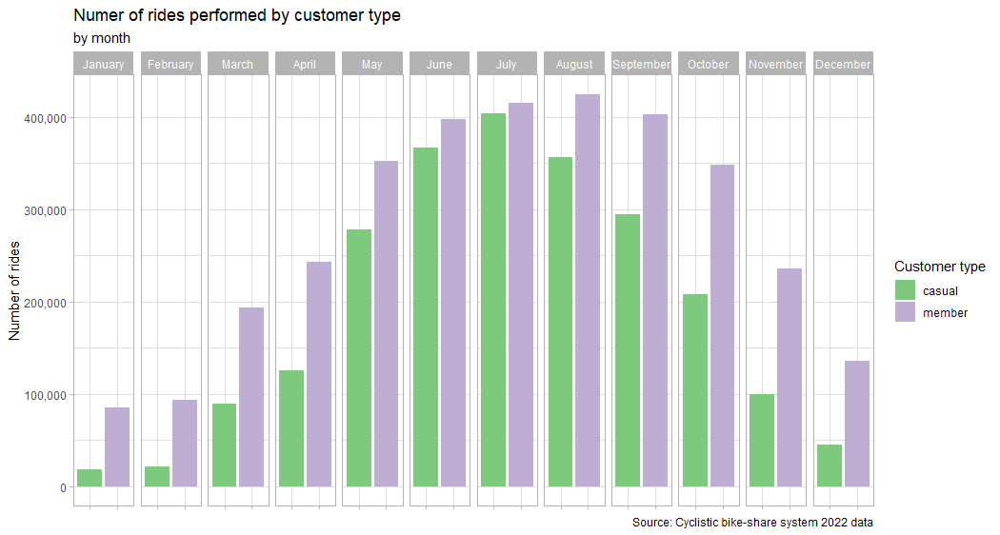

``` r
ggplot(all_2022_data_summary, aes(x = month, y = num_of_rides, fill = customer_type)) + 
  geom_col(show.legend = FALSE) +
  facet_grid(~customer_type) + 
  scale_y_continuous(labels = scales::comma) +
  scale_x_discrete(breaks = c("01", "02", "03", "04", "05", "06", "07", "08", "09", "10", "11", "12"),
                   labels = c("January", "February", "March", "April", "May", "June", "July", "August", "September", "October", "November", "December")) +
  scale_fill_brewer(palette = 'Accent') +
  theme_light() +
  theme(axis.text.x = element_text(angle = 45, hjust = 1)) +
  labs(x = 'Month', y = 'Number of rides', title = 'Numer of rides performed by customer type', subtitle = 'by month', caption = 'Source: Cyclistic bike-share system 2022 data')
```
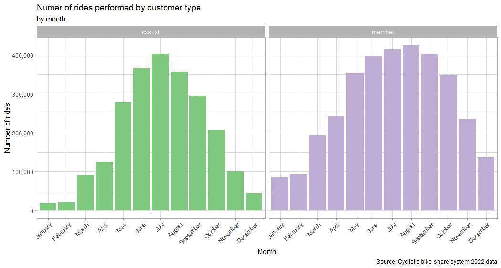


## SUMMARY ABOVE SHOWS THAT IN A YEAR VIEW, MOST POPULAR MONTH AMONG CASUAL USERS ARE: ….(…RIDES),… AND …. WHILE IN GROUP OF USERS WHO HAS ANNUAL SUBSCRIPTION MOST POPULAR ARE:

\#ANOTHER THING IS THAT IN EACH MONTH MEMBER USERS PERFORMED MORE RIDES
THAN CASUAL USERS. WHAT MORE, MEMBER USERS PERFORM AT LEAST 350 000
RIDES PER MONTH IN ALMOST HALF OF THE YEAR (THE 6TH MOST POPULAR MONTH
FOR THIS GROUP IS OCTOBER WITH 347 690 RIDES) WHILE CASUAL USERS PERFORM
OVER 350 000 RIDES ONLY IN 3 MONTHS PER YEAR

## NUM OF RIDES STARTED AT EACH PART OF DAY BY USERS

``` r
ggplot(all_2022_data_summary, aes(x = customer_type, y = num_of_rides, fill = customer_type)) + 
  geom_col() +
  facet_grid(~factor(started_at_part_of_day, levels = c("Morning", "Afternoon", "Evening", "Night"))) +
  scale_fill_brewer(palette = 'Dark2') +
  scale_y_continuous(labels = scales::comma) +
  theme_light() + 
  theme(axis.text.x = element_blank()) +
  labs(x = NULL, y = 'Number of rides', title = 'Numer of rides performed by customer type', subtitle = 'by part of day when ride started', caption = 'Source: Cyclistic bike-share system 2022 data') +
  guides(fill = guide_legend(title = "Customer type"))
```

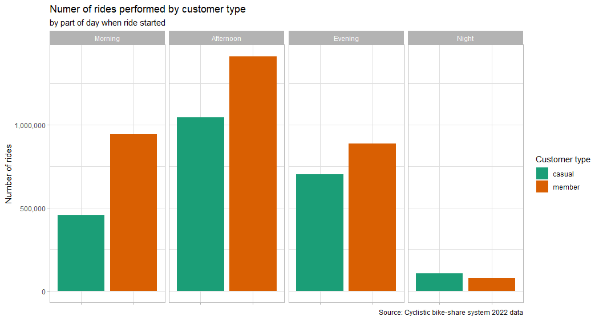

## NUM OF RIDES STARTED AT EACH PART OF DAY BY USERS

``` r
ggplot(all_2022_data_summary, aes(x = started_at_part_of_day, y = num_of_rides, fill = customer_type)) + 
  geom_col(show.legend = FALSE) +
  facet_grid(~customer_type) +
  scale_fill_brewer(palette = 'Dark2') +
  scale_x_discrete(limits = c("Morning", "Afternoon", "Evening", "Night")) + 
  scale_y_continuous(labels = scales::comma) + 
  theme_light() +
  labs(x = 'Part of day when ride started', y = 'Number of rides', title = 'Numer of rides performed by customer type', subtitle = 'by part of day', caption = 'Source: Cyclistic bike-share system 2022 data')
```

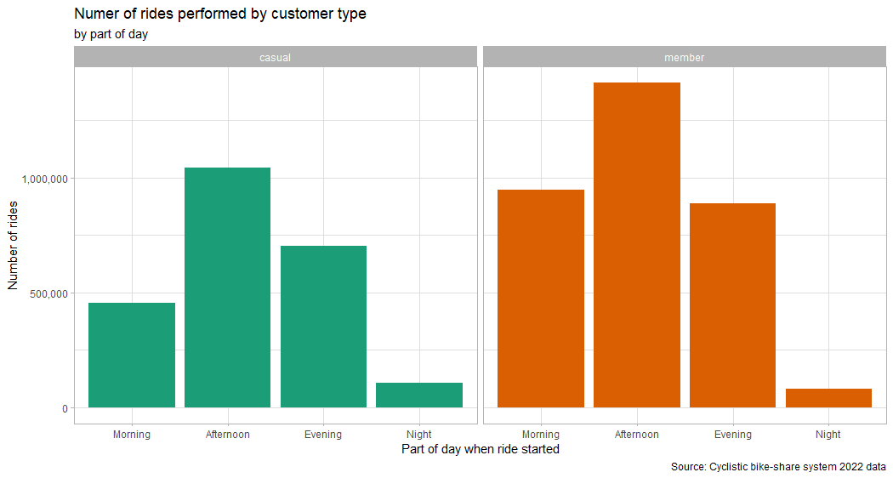

``` r
all_2022_data_calc <- all_2022_data %>% 
  group_by(customer_type, start_day_of_week) %>% 
  summarise(num_of_rides = n())

kable(all_2022_data_calc)
```

| customer_type | start_day_of_week | num_of_rides |
|:--------------|------------------:|-------------:|
| casual        |                 1 |       275757 |
| casual        |                 2 |       261949 |
| casual        |                 3 |       272538 |
| casual        |                 4 |       307301 |
| casual        |                 5 |       332365 |
| casual        |                 6 |       469872 |
| casual        |                 7 |       386103 |
| member        |                 1 |       470732 |
| member        |                 2 |       515841 |
| member        |                 3 |       520850 |
| member        |                 4 |       529447 |
| member        |                 5 |       464394 |
| member        |                 6 |       440506 |
| member        |                 7 |       384788 |

## NUM OF RIDES STARTED AT EACH DAY OF WEEK BY USERS

``` r
ggplot(all_2022_data_summary, aes(x = customer_type, y = num_of_rides, fill = customer_type)) + 
  geom_col() + 
  facet_grid(~start_day_of_week, labeller = labeller(start_day_of_week = c(
    "1" = "Monday",
    "2" = "Tuesday",
    "3" = "Wednesday",
    "4" = "Thursday",
    "5" = "Friday",
    "6" = "Saturday",
    "7" = "Sunday"))) +
  scale_fill_brewer(palette = 'Dark2') + 
  scale_y_continuous(labels = scales::comma) +
  theme_light() +
  theme(axis.text.x = element_blank()) + 
  labs(x = NULL, y = 'Number of rides', title = 'Numer of rides performed by customer type', subtitle = 'by day of week', caption = 'Source: Cyclistic bike-share system 2022 data') +
  guides(fill = guide_legend(title = "Customer type"))
```

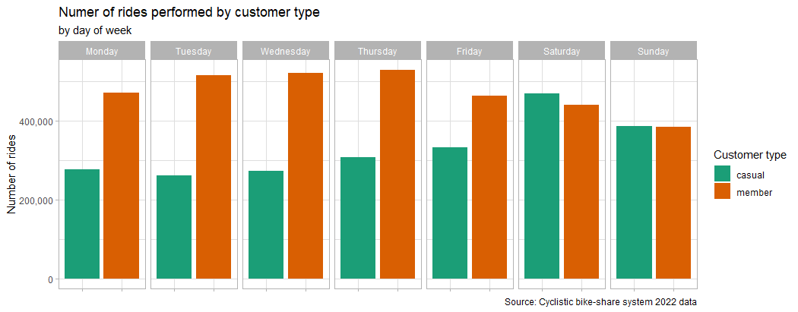


``` r
ggplot(all_2022_data_summary, aes(x = start_day_of_week, y = num_of_rides, fill = customer_type)) + 
  geom_col(show.legend = FALSE) + 
  facet_wrap(~customer_type) +
  scale_fill_brewer(palette = 'Dark2') + 
  scale_x_discrete(limits = c("Monday", "Tuesday", "Wednesday", "Thursday", "Friday", "Saturday", "Sunday")) + 
  scale_y_continuous(labels = scales::comma) +
  theme_light() +
  labs(x = 'Day of week when ride started', y = 'Number of rides', title = 'Numer of rides performed by customer type', subtitle = 'by day of week', caption = 'Source: Cyclistic bike-share system 2022 data') +
  guides(x = guide_axis(angle = 45))
```

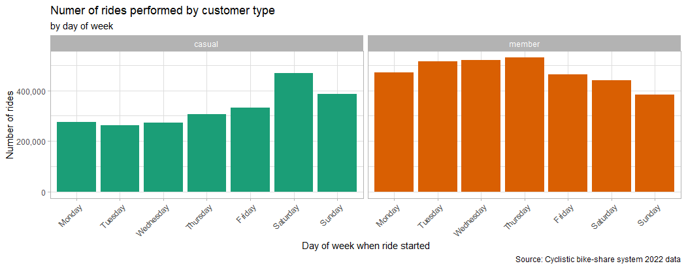


\#MEAN RIDE TIME BY CUSTOMER TYPE

``` r
ggplot(all_2022_data_summary, aes(x = customer_type, y = mean_ride_len, fill = customer_type)) + 
  geom_bar(stat = "summary", fun = "mean", show.legend = FALSE) +
  scale_fill_brewer(palette = 'Set1') +
  theme_light() +
  labs(x = 'Customer type', y = 'Mean ride length [min]', title = 'Mean ride length', subtitle = 'by customer type', caption = 'Source: Cyclistic bike-share system 2022 data')
```
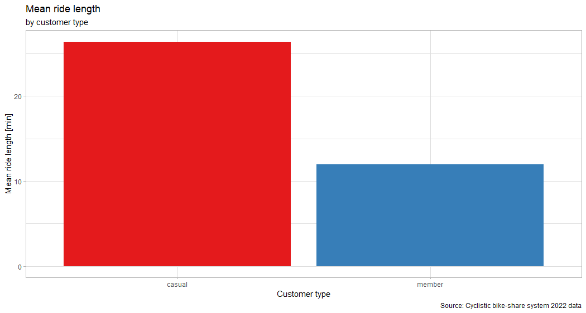


``` r
ggplot(all_2022_data_summary, aes(x = customer_type, y = mean_ride_len, fill = customer_type)) + 
  geom_bar(stat = "summary", fun = "mean") + 
  facet_grid(~month, labeller = labeller(month = c(
    "01" = "January",
    "02" = "February",
    "03" = "March",
    "04" = "April",
    "05" = "May",
    "06" = "June",
    "07" = "July",
    "08" = "August",
    "09" = "September",
    "10" = "October",
    "11" = "November",
    "12" = "December"))) +
  scale_fill_brewer(palette = 'Accent') +
  theme_light() + 
  theme(axis.text.x = element_blank()) +
  labs(x = NULL, y = 'Mean ride length [min]', title = 'Mean ride length by customer type', subtitle = 'by month', caption = 'Source: Cyclistic bike-share system 2022 data') + 
  guides(fill = guide_legend(title = "Customer type"))
```
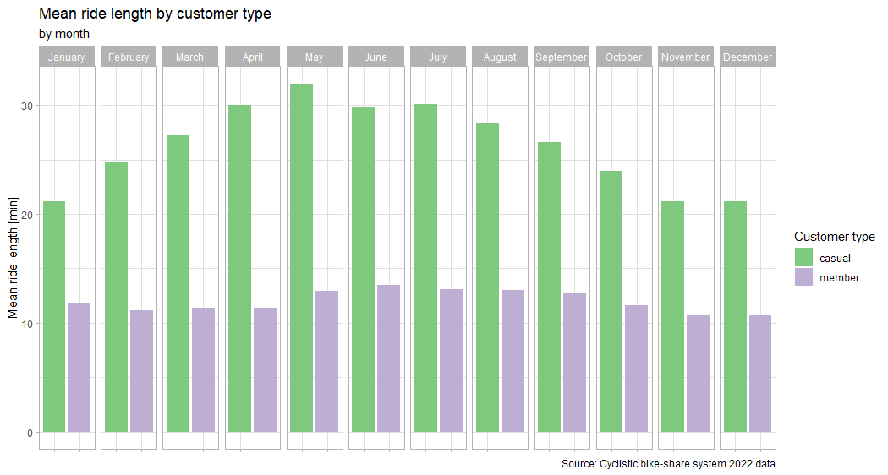


``` r
ggplot(all_2022_data_summary, aes(x = month, y = mean_ride_len, fill = customer_type)) + 
  geom_bar(stat = 'summary', fun = 'mean', show.legend = FALSE) +
  facet_grid(~customer_type) + 
  scale_fill_brewer(palette = 'Accent') +
  scale_x_discrete(breaks = c("01", "02", "03", "04", "05", "06", "07", "08", "09", "10", "11", "12"),
                   labels = c("January", "February", "March", "April", "May", "June", "July", "August", "September", "October", "November", "December")) +
  scale_y_continuous(labels = scales::comma) + 
  theme_light() +
  theme(axis.text.x = element_text(angle = 45, hjust = 1)) +
  labs(x = 'Month', y = 'Mean ride length [min]', title = 'Mean ride length by customer type', subtitle = 'by month', caption = 'Source: Cyclistic bike-share system 2022 data') + 
  guides(fill = guide_legend(title = "Customer type"))
```
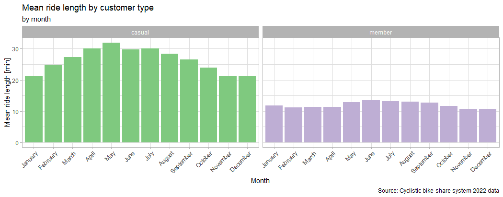

\#AS SHOWED ABOVE, MEAN RIDE TIME FOR CASUAL USER IS HIGHER THAN FOR
MEMBER BUT DEPENDS ON MONTH WHILE MEAN FOR MEMBER IS CONSISTENT
THROUGHOUT THE YEAR.

``` r
ggplot(all_2022_data_summary, aes(x = customer_type, y = mean_ride_len, fill = customer_type)) + 
  geom_bar(stat = "summary", fun = "mean") +
  facet_grid(~factor(started_at_part_of_day, levels = c("Morning", "Afternoon", "Evening", "Night"))) +
  scale_fill_brewer(palette = 'Dark2') +
  theme_light() + 
  theme(axis.text.x = element_blank()) + 
  labs(x = NULL, y = 'Mean ride length [min]', title = 'Mean ride length by customer type', subtitle = 'by part of day when ride started', caption = 'Source: Cyclistic bike-share system 2022 data') + 
  guides(fill = guide_legend(title = "Customer type"))
```

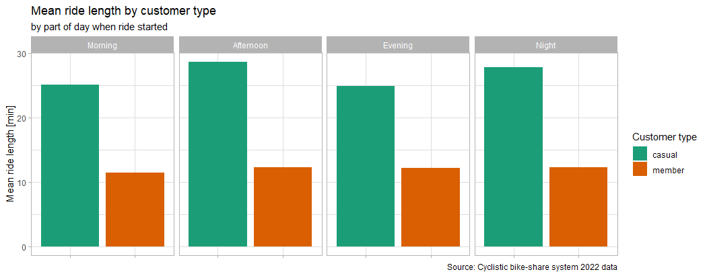

``` r
ggplot(all_2022_data_summary, aes(x = started_at_part_of_day, y = mean_ride_len, fill = customer_type)) + 
  geom_bar(stat = "summary", fun = "mean", show.legend = FALSE) + 
  facet_wrap(~customer_type) +
  scale_fill_brewer(palette = 'Dark2') +
  scale_x_discrete(limits = c('Morning', 'Afternoon', 'Evening', 'Night')) +
  theme_light() +
  labs(x = 'Part of day when ride started', y = 'Mean ride length [min]', title = 'Mean ride length by customer type', subtitle = 'by part of day', caption = 'Source: Cyclistic bike-share system 2022 data')
```

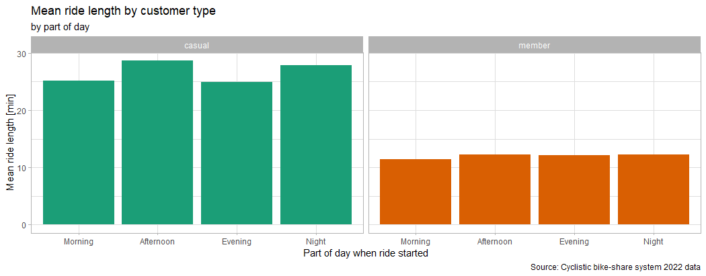

``` r
ggplot(all_2022_data_summary, aes(x = customer_type, y = mean_ride_len, fill = customer_type)) + 
  geom_bar(stat = "summary", fun = "mean") +
  facet_grid(~start_day_of_week, labeller = labeller(start_day_of_week = c(
    '1' = 'Monday',
    '2' = 'Tuesday',
    '3' = 'Wednesday',
    '4' = 'Thursday',
    '5' = 'Friday',
    '6' = 'Saturday',
    '7' = 'Sunday'))) +
  scale_fill_brewer(palette = 'Dark2') +
  theme_light() + 
  theme(axis.text.x = element_blank()) +
  labs(x = NULL, y = 'Mean ride length [min]', title = 'Mean ride length by customer type', subtitle = 'by day of week', caption = 'Source: Cyclistic bike-share system 2022 data') + 
  guides(fill = guide_legend(title = "Customer type"))
```
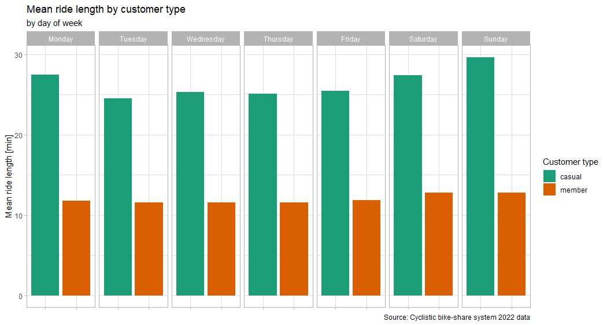


``` r
ggplot(all_2022_data_summary, aes(x = start_day_of_week, y = mean_ride_len, fill = customer_type)) + 
  geom_bar(stat = "summary", fun = "mean", show.legend = FALSE) + 
  facet_grid(~customer_type) +
  scale_fill_brewer(palette = 'Dark2') + 
  scale_x_discrete(limits = c("Monday", "Tuesday", "Wednesday", "Thursday", "Friday", "Saturday", "Sunday")) + 
  theme_light() +
  labs(x = 'Day of week', y = 'Mean ride length [min]', title = 'Mean ride length by customer type', subtitle = 'by day of week', caption = 'Source: Cyclistic bike-share system 2022 data') + 
  guides(x = guide_axis(angle = 45))
```
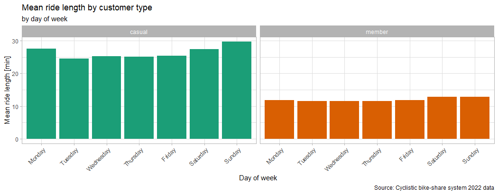

\#MEAN RIDE TIME VS NUMBER OF RIDES PERFORMED BY CASUALS AND MEMBERS (2
RIDES WERE EXCLUDED - DODAĆ TABELĘ TOP 10 RIDES)

``` r
ggplot(all_2022_data_summary, aes(x = mean_ride_len, y = num_of_rides, color = customer_type)) + 
  geom_point(stat = "summary", fun = "mean") +
  scale_x_continuous(limits = c(0, 360), breaks = seq(0, 360, by = 60)) +
  theme_light() +
  labs(x = 'Mean ride length [min]', y = 'Number of rides', title = 'Mean ride length by customer type', subtitle = 'by number of rides', caption = 'Source: Cyclistic bike-share system 2022 data') +
  guides(title = "Customer type")
```
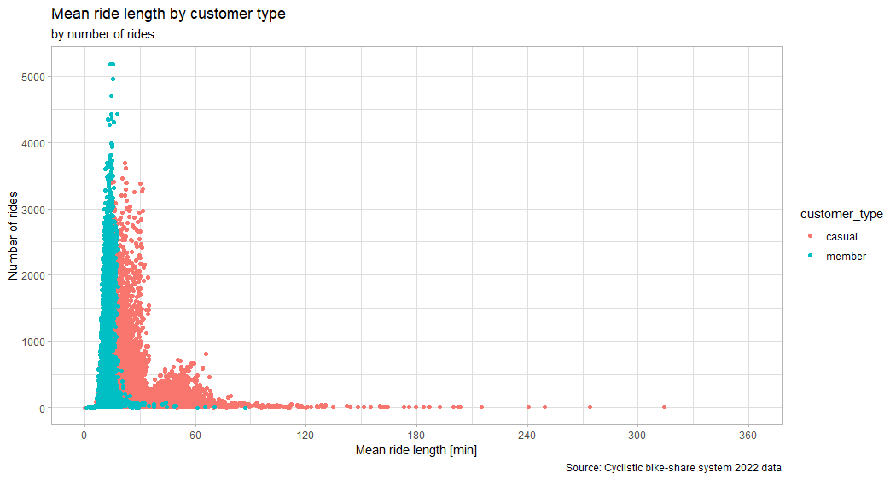

\#LETS EXPLORE THE PEAK BETWEEN RIDES THAT LASTS BETWEEN 35 AND 70
MINUTES PERFORMED BY CASUAL RIDERS

``` r
#1ST CASUAL PEAK IN DETAILS
ggplot(all_2022_data_summary, aes(x = mean_ride_len, y = num_of_rides, color = customer_type)) + 
  geom_point(stat = "summary", fun = "mean") +
  scale_x_continuous(limits = c(20, 90), breaks = seq(0, 90, by = 5)) +
  theme_light() +
  labs(x = 'Mean ride length [min]', y = 'Number of rides', title = 'Mean ride length', subtitle = 'by number of rides', caption = 'Source: Cyclistic bike-share system 2022 data') +
  guides(color = guide_legend(title = "Customer type"))
```
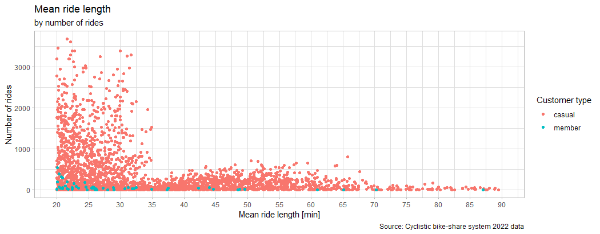


``` r
ggplot(all_2022_data_summary, aes(x = mean_ride_len, y = num_of_rides, color = customer_type)) + 
  geom_point(stat = "summary", fun = "mean") + 
  facet_wrap(~rideable_type) + 
  scale_x_continuous(limits = c(20, 90), breaks = seq(0, 90, by = 20)) +
  labs(x = 'Mean ride length [min]', y = 'Number of rides', title = 'Mean ride length by ridealble type', subtitle = 'by number of rides', caption = 'Source: Cyclistic bike-share system 2022 data')
```
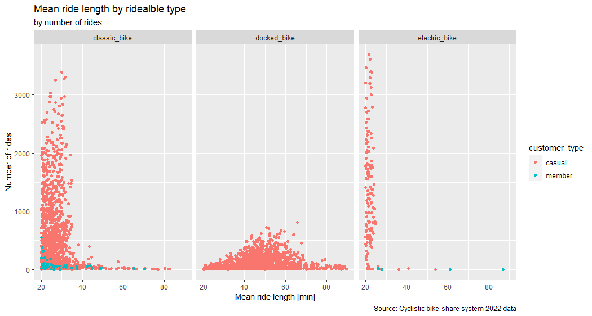


## 5. SHARE PHASE

In addition to plots created in R Studio (included in analyze phase), data was visualized on Tableau Public page:


### <a href="https://public.tableau.com/views/GoogleDACertificateCapstoneProject-Bike-sharecasestudy/GDAPCDashboard?:language=en-US&:display_count=n&:origin=viz_share_link">For a full interactive dashboard view click this link</a>

html table test


## 6. ACT PHASE

