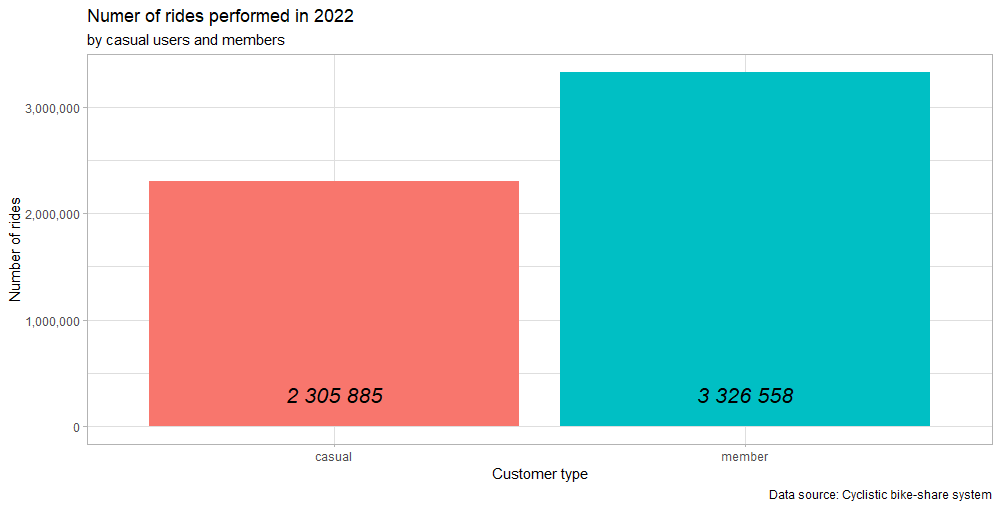

GOOGLE DATA ANALYTICS PROFESSIONAL CERTIFICATE CAPSTONE PROJECT
================

# INTRODUCTION

The case study below is a part of Google Data Analytics Professional
Certificate program. It covers all six phases of data analysis process:
ask, prepare, process, analyze, share and act. The data used in this
project were provided by course administrator – Google and contains data
and information about fictional bike-share company – Cyclistic. In this
scenario, I am a junior data analyst in Cyclistic marketing analytics
team and were assigned to a new project which should provide insights
that will drive a Cyclistics new marketing strategy.

PRZEROBIONE PRZEZ GPT:

The following case study is a component of the Google Data Analytics
Professional Certificate program. It encompasses all six phases of the
data analysis process: *ask, prepare, process, analyze, share, and act.
The data utilized for this project was furnished by the course
administrator, Google, and consists of data and information pertaining
to the fictional bike-share company, Cyclistic. In this context, I
assume the role of a Junior Data Analyst within Cyclistic’s Marketing
Analytics team, having been tasked with a new project aimed at
delivering insights to inform Cyclistic’s forthcoming marketing
strategy.*

## 1. ASK PHASE

The Cyclistic’s forthcoming marketing strategy will be guided by the
questions below:

1.  How do annual members and casual riders use Cyclistic bikes
    differently?

2.  Why would casual riders buy Cyclistic annual memberships?

3.  How can Cyclistic use digital media to influence casual riders to
    become members?

The director of marketing, Lily Moreno, has assigned me a first question
to answear.

Assigned part of the analytics project will be guided by this business
task:

<u>Pointing habit patterns and behavior differences in casual and annual
Cyclistic user groups.</u>

## 2. PREPARE PHASE

Used data comes internal from Cyclistic system. It is organized in csv
files – each file contains quantitative set of data for each month and
it covers whole year 2022. Data does not contain any personal
information about the users and can not be connected with any specific
one. One row contain data about one ride taken by user.

Since it is every ride data and it is collected automatically, it is
free of observer, sampling and confirmation bias. It also fulfills the
conditions of good data (it is reliable, original, comprehensive,
current and cited). Data’s licensing, privacy, security and
accessibility are specified in Data License Agreement available under
<https://divvybikes.com/data-license-agreement> site.

Problems with provided data that could create problems during the
analysis:

- *The amount of rides make it impossible to analyze a full year view in
  one spreadsheet.*

- *The start and end station names are not always provided.*

- *The start and end station names are not consistent. Further analysis
  showed that there is difference between number of station id’s and
  station names (same stations – by id - are sometimes named
  differently).*

- *The latitude and longitude of stations does not always have same
  accuracy (differences in decimal places) but is 100% complete.
  However, according to provided information, coordinates are not used
  in this analysis project .*

- *Because data is anonymized, it is impossible to link ride with user
  and analyze his ride history.*

## 3. PROCESS PHASE

For initial cleaning and manipulating purposes Excel spreadsheet and
Excel’s Power Query tool were used. Since the amount of data is too big
to be analyzed in one spreadsheet (5 667 711 rows), each file have been
checked, cleaned and transformed separately.

Cleaning details:

TABELA Z WORDA

Rows deleted during cleaning:


Cleaning process reduced number of rows by 0,62%; total number of
deleted rows = 35268.

Data manipulation increased number of columns from 13 to 19. New data
columns:

- started_at_hour - hour when ride started,

- started_at_hour_as_num - hour when hour started presented as number
  data type,

- start_id_len - length of hashed ride_id,

- ride_len - length of ride,

- start_day_of_week - day of week when ride started,

- started_at_part_of_day - part of day when ride started.

After cleaning and manipulating, each file was saved as csv file (for
analysis in R Studio, Big Query SQL and Tableau visualizations) and xlsx
file. In each months xlxs file new pivot table sheet with cleaned and
manipulated data were created.

## 4. ANALYZE PHASE

Like mentioned above, the number of rows is too big to store and analyze
data in one spreadsheet, so data have been imported into R Studio.

### DATA IMPORT AND BIND

``` r
jan_2022_data <- read.csv("D:/GDAPC Case study/01_Bike_share/cleaned_in_excel/csv/012022_tripdata.csv", sep = ';')
feb_2022_data <- read.csv("D:/GDAPC Case study/01_Bike_share/cleaned_in_excel/csv/022022_tripdata.csv", sep = ';')
mar_2022_data <- read.csv("D:/GDAPC Case study/01_Bike_share/cleaned_in_excel/csv/032022_tripdata.csv", sep = ';')
apr_2022_data <- read.csv("D:/GDAPC Case study/01_Bike_share/cleaned_in_excel/csv/042022_tripdata.csv", sep = ';')
may_2022_data <- read.csv("D:/GDAPC Case study/01_Bike_share/cleaned_in_excel/csv/052022_tripdata.csv", sep = ';')
jun_2022_data <- read.csv("D:/GDAPC Case study/01_Bike_share/cleaned_in_excel/csv/062022_tripdata.csv", sep = ';')
jul_2022_data <- read.csv("D:/GDAPC Case study/01_Bike_share/cleaned_in_excel/csv/072022_tripdata.csv", sep = ';')
aug_2022_data <- read.csv("D:/GDAPC Case study/01_Bike_share/cleaned_in_excel/csv/082022_tripdata.csv", sep = ';')
sep_2022_data <- read.csv("D:/GDAPC Case study/01_Bike_share/cleaned_in_excel/csv/092022_tripdata.csv", sep = ';')
oct_2022_data <- read.csv("D:/GDAPC Case study/01_Bike_share/cleaned_in_excel/csv/102022_tripdata.csv", sep = ';')
nov_2022_data <- read.csv("D:/GDAPC Case study/01_Bike_share/cleaned_in_excel/csv/112022_tripdata.csv", sep = ';')
dec_2022_data <- read.csv("D:/GDAPC Case study/01_Bike_share/cleaned_in_excel/csv/122022_tripdata.csv", sep = ';')
```

``` r
all_2022_data <- rbind(jan_2022_data, feb_2022_data, mar_2022_data, apr_2022_data,
                       may_2022_data, jun_2022_data, jul_2022_data, aug_2022_data,
                       sep_2022_data, oct_2022_data, nov_2022_data, dec_2022_data)
```

## INITIAL DATA CHECK

``` r
library(dplyr)
library(skimr)

glimpse(all_2022_data)
skim_without_charts(all_2022_data)
```

All data was imported and binded properly and it is organized in 5 632
443 rows and 19 columns, all rows complete_rate is equal to 1 (which
indicates that it is 100% complete). Except end_station_id row
(complere_rate = 0,841), the reason of that was mentioned before.

Data check showed that started_at, ended_at and ride_len columns were
imported as characters instead of datetime and duration data types. So
it needs to be changed:

## DATA TYPES CHANGE

``` r
library(tidyverse)
library(lubridate)

all_2022_data <- all_2022_data %>% 
  mutate(
    started_at = as_datetime(started_at, format = '%d.%m.%Y %H:%M'),
    ended_at = as_datetime(ended_at, format = '%d.%m.%Y %H:%M'),
    ride_len = difftime(ended_at, started_at, units = 'sec'),
  )
```

As all data were merged into one file, additional month column will be
needed for analysis:

## ADDITIONAL COLUMNS FOR CALCS AND VIZ

``` r
all_2022_data <- all_2022_data %>% 
  mutate(month = substr(started_at, 6, 7)
        )
```

## SUMMARY OF DATA BEFORE CALCS

``` r
all_2022_data_summary <- all_2022_data %>%
  group_by(customer_type, month, rideable_type) %>% 
  summarise(
    num_of_rides = n(),
    mean_ride_len = mean(ride_len),
    mode_of_day_of_week = median(start_day_of_week),
    mode_of_part_of_day_1 = names(sort(table(started_at_part_of_day), decreasing = TRUE)[1]),
    )

View(all_2022_data_summary)
```

## SUMMARY ABOVE SHOWS THAT ALL SUBGROUPS RIDES mode_of_part_of_day =‘Afternoon’ \#SO I DECIDED TO ADD A NEW COLUMN WITH FULL HOUR WHEN RIDE

STARTED:

``` r
all_2022_data <- all_2022_data %>% 
  mutate(started_at_full_hour = substr(started_at_hour, 1, 2))
```

## FINAL DF SUMMARY OF DATA BEFORE CALCS

``` r
all_2022_data_summary <- all_2022_data %>%
  group_by(customer_type, month, rideable_type, start_day_of_week, started_at_part_of_day, started_at_full_hour) %>% 
  summarise(
    num_of_rides = n(),
    mean_ride_len = mean(ride_len)
           )
```

## BASIC CALCULATIONS AND PLOTS

\#TOTAL RIDES BY CUSTOMER TYPE

``` r
all_2022_data_rides <- all_2022_data %>%
  group_by(customer_type) %>% 
  summarise(num_of_rides = n())

View(all_2022_data_rides)
```

``` r
ggplot(all_2022_data_summary, aes(x = customer_type, y = num_of_rides)) + geom_col()
```


``` r
all_2022_data_rides <- all_2022_data %>%
  group_by(customer_type, month) %>% 
  summarise(num_of_rides = n()) %>% 
  arrange(-num_of_rides)
```

``` r
ggplot(all_2022_data_summary, aes(x = customer_type, y = num_of_rides)) + geom_col() + facet_wrap(~month)
```

``` r
ggplot(all_2022_data_summary, aes(x = month, y = num_of_rides)) + geom_col() + facet_wrap(~customer_type)
```

## SUMMARY ABOVE SHOWS THAT IN A YEAR VIEW, MOST POPULAR MONTH AMONG CASUAL USERS ARE: ….(…RIDES),… AND …. WHILE IN GROUP OF USERS WHO HAS ANNUAL SUBSCRIPTION MOST POPULAR ARE:

\#ANOTHER THING IS THAT IN EACH MONTH MEMBER USERS PERFORMED MORE RIDES
THAN CASUAL USERS

## NUM OF RIDES STARTED AT EACH PART OF DAY BY USERS

## NUM OF RIDES STARTED AT EACH DAY OF WEEK BY USERS

``` r
ggplot(all_2022_data_summary, aes(x = start_day_of_week, y = num_of_rides)) + geom_col() + facet_wrap(~customer_type) + scale_x_discrete(limits = c("Monday", "Tuesday", "Wednesday", "Thursday", "Friday", "Saturday", "Sunday"))
```

## NUM OF RIDES STARTED AT EACH DAY OF WEEK BY USERS

``` r
ggplot(all_2022_data_summary, aes(x = started_at_full_hour, y = num_of_rides)) + geom_col() + facet_wrap(~customer_type)
```

\#MEAN RIDE TIME BY CUSTOMER TYPE

``` r
ggplot(all_2022_data_summary, aes(x = customer_type, y = mean_ride_len)) + geom_bar(stat = "summary", fun = "mean")
```

``` r
ggplot(all_2022_data_summary, aes(x = customer_type, y = mean_ride_len)) + geom_bar(stat = "summary", fun = "mean") + facet_wrap(~month)
```

``` r
ggplot(all_2022_data_summary, aes(x = started_at_part_of_day, y = mean_ride_len)) + geom_bar(stat = "summary", fun = "mean") + facet_wrap(~customer_type)
```

``` r
ggplot(all_2022_data_summary, aes(x = customer_type, y = mean_ride_len)) + geom_bar(stat = "summary", fun = "mean") + facet_wrap(~started_at_part_of_day)
```

``` r
ggplot(all_2022_data_summary, aes(x = started_at_part_of_day, y = mean_ride_len)) + geom_bar(stat = "summary", fun = "mean") + facet_wrap(~customer_type)
```

``` r
ggplot(all_2022_data_summary, aes(x = customer_type, y = mean_ride_len)) + geom_bar(stat = "summary", fun = "mean") + facet_wrap(~started_at_part_of_day)
```
