GOOGLE DATA ANALYTICS PROFESSIONAL CERTIFICATE CAPSTONE PROJECT
================

# INTRODUCTION

#### The following case study is a part of Google Data Analytics Professional Certificate program. It covers all six phases of data analysis process: Ask, Prepare, Process, Analyze, Share and Act. The data used in this project were provided by the course administrator – Google and contains data and information about fictional bike-share company – Cyclistic. In this context, I am a Junior Data Analyst in Cyclistic’s Marketing Analytics team and have been tasked with a new project aimed insights that will drive a Cyclistic’s new marketing strategy.

------------------------------------------------------------------------

# 1. ASK PHASE

The Cyclistic’s forthcoming marketing strategy will be guided by the
questions below:

1.  How do annual members and casual riders use Cyclistic bikes
    differently?

2.  Why would casual riders buy Cyclistic annual memberships?

3.  How can Cyclistic use digital media to influence casual riders to
    become members?

The director of marketing, Lily Moreno, has assigned me a first question
to answear.

Assigned part of the analytics project will be guided by this business
task:

<u>Pointing habit patterns and behavior differences in casual and annual
Cyclistic user groups.</u>

# 2. PREPARE PHASE

Used data comes from internal Cyclistic system. It is organized in csv
files – each file contains quantitative set of data for each month and
it covers whole year 2022. Data does not contain any personal
information about the users and can not be connected with any specific
one. One row contain data about one ride taken.

Since it is every ride data and it is collected automatically, it is
free of observer, sampling and confirmation bias. It also fulfills the
conditions of good data (it is reliable, original, comprehensive,
current and cited). Data’s licensing, privacy, security and
accessibility are specified in Data License Agreement available under
<https://divvybikes.com/data-license-agreement> site.

Issues with provided data that could create problems during the
analysis:

- *the amount of rides make it impossible to analyze a full year view in
  one spreadsheet,*

- *the start and end station names are not always provided,*

- *the start and end station names are not consistent. Further analysis
  showed that there is difference between number of station id’s and
  station names (same stations – by id - are sometimes named
  differently).*

- *The latitude and longitude of stations does not always have same
  accuracy but is 100% complete. However, according to provided case
  study information, coordinates are not used in this analysis project*

- *Because data is anonymized, it is impossible to link ride with user
  and analyze ones ride history.*

# 3. PROCESS PHASE

For initial cleaning and manipulating purposes Excel spreadsheet and
Excel’s Power Query tool were used. Since the amount of data is too big
to be analyzed in one spreadsheet (5 667 711 rows), each file have been
checked, cleaned and transformed separately.

Cleaning details:

<html>
    <table><thead>
  <tr>
    <th>Column(s)<br></th>
    <th>Action</th>
  </tr>
</thead>
<tbody>
  <tr style="text-align: center;">
    <td colspan="2">STEPS IN EXCEL POWER QUERY TOOL</td>
  </tr>
  <tr>
    <td>all</td>
    <td>Checking if all columns have the right data type; changed where necessary.</td>
  </tr>
  <tr>
    <td>member_casual</td>
    <td>Changing column name to customer_type for clarity.</td>
  </tr>
  <tr>
    <td>started_at,<br>started_at_hour</td>
    <td>Duplicating started_at column and extracting new started_at_hour column from it, needed in further analysis</td>
  </tr>
  <tr>
    <td>Started_at_hour_as_num</td>
    <td>Adding new started_at_hour_as_num column to convert ‘started_at_hour’ values into number (decimal) data type; needed in further analysis.</td>
  </tr>
  <tr>
    <td>ride_id_len</td>
    <td>Adding new ride_id_len column for checking if hashed ride_id length is consistent (every ride_id_len should be 16 characters long).<br>Used formula: =Text.Length([ride_id])<br></td>
  </tr>
  <tr>
    <td>ride_len</td>
    <td>Adding new ride_len column with subtracted ‘ended_at’ and ‘started_at’ columns for calculating each ride length time.<br>Used formula: =[ended_at]-[started_at]</td>
  </tr>
  <tr>
    <td>start_day_of_week</td>
    <td>Adding new start_day_of_week column for extracting day of week when ride started.<br>Note: 1 = Monday, …, 7 = Sunday<br>Used formula: =Date.DayOfWeek([started_at]) + 1</td>
  </tr>
  <tr>
    <td colspan="2">STEPS IN EXCEL</td>
  </tr>
  <tr>
    <td>all</td>
    <td>Remove duplicates tool for checking duplicated rows</td>
  </tr>
  <tr>
    <td>ridealble_type, customer_type</td>
    <td>Filtering tool for checking distinct values.</td>
  </tr>
  <tr>
    <td>all</td>
    <td>Checking for null values.<br>Note: despite null values in some ‘start_station_name’, ‘start_station_id’, ‘end_station_name’ and ‘end_station_id’ rows, these are removed only if at least one of four coordinates (start_lat, start_lng, end_lat, end_lng) is missing.<br></td>
  </tr>
  <tr>
    <td>start_lat, start_lng, end_lat, end_lng</td>
    <td>Checking if values are in appropriate coordinates range; delete where necessary.</td>
  </tr>
  <tr>
    <td>started_part_of_day</td>
    <td>Creating nested =IF() function for defining new parameter – part of the day when the ride started - in new column.<br>Note:<br>Morning = 6:00 AM to 12:00 PM<br>Afternoon = 12:01 PM to 5:59 PM<br>Evening = 6:00 PM to 11:59 PM<br>Night = 12:00 AM to 5:59 AM<br>Used formula: =IF([@[started_at_hour_as_num]]&gt;0,74999;"Evening";IF([@[started_at_hour_as_num]]&gt;0,5;"Afternoon";IF([@[started_at_hour_as_num]]&gt;0,166655;"Morning";"Night"))<br></td>
  </tr>
  <tr>
    <td>Ride_len</td>
    <td>Checking values.<br>According to provided information, casual members are those who purchase single-ride or full-day passes. Since there is no any additional information, all rides where:<br>•    ride_len &gt; 1.00:00:00 (24 hours)<br>AND<br>•    customer_type = casual<br>are filtered out.<br><br>Hypothesis: all rides up to 0.00:00:10 (10 seconds) may be indicator of some rent issuses, user plans change etc. Initial test (if start coordinates are equal to end coordinates) showed that the overwhelming majority of short (&lt; 10 sec) rides are starting and ending at the same station.<br>Final confirmation or rejection of this hypothesis needs some more information from the company. <br>Having regard to the above, as a safe solution, all rides shorter than 11 seconds were filtered out.<br></td>
  </tr>
</tbody>
</table>
</html>

Rows deleted during cleaning:

<html>
    <table><thead>
  <tr>
    <th rowspan="2"></th>
    <th colspan="2">start_lat</th>
    <th colspan="2">start_lng</th>
    <th colspan="2">end_lat</th>
    <th colspan="2">end_lng</th>
    <th rowspan="2">Ride_len &gt; 24 h<br>AND<br>Customer_type = casual</th>
    <th rowspan="2">&nbsp;&nbsp;&nbsp;<br>Ride_len &lt; 10 sec&nbsp;&nbsp;&nbsp;</th>
  </tr>
  <tr>
    <th>Values out of proper range</th>
    <th>nulls</th>
    <th>Values out of proper range</th>
    <th>nulls</th>
    <th>Values out of proper range</th>
    <th>nulls</th>
    <th>Values out of proper range</th>
    <th>nulls</th>
  </tr>
</thead>
<tbody>
  <tr>
    <td>January</td>
    <td></td>
    <td></td>
    <td>1</td>
    <td></td>
    <td></td>
    <td>&nbsp;&nbsp;&nbsp;<br>86&nbsp;&nbsp;&nbsp;</td>
    <td></td>
    <td></td>
    <td>19</td>
    <td>550</td>
  </tr>
  <tr>
    <td>February</td>
    <td></td>
    <td></td>
    <td></td>
    <td></td>
    <td></td>
    <td>&nbsp;&nbsp;&nbsp;<br>77&nbsp;&nbsp;&nbsp;</td>
    <td></td>
    <td></td>
    <td>65</td>
    <td>907</td>
  </tr>
  <tr>
    <td>March</td>
    <td></td>
    <td></td>
    <td></td>
    <td></td>
    <td></td>
    <td>&nbsp;&nbsp;&nbsp;<br>266&nbsp;&nbsp;&nbsp;</td>
    <td></td>
    <td></td>
    <td>42</td>
    <td>1470</td>
  </tr>
  <tr>
    <td>April</td>
    <td></td>
    <td></td>
    <td></td>
    <td></td>
    <td></td>
    <td>&nbsp;&nbsp;&nbsp;<br>317&nbsp;&nbsp;&nbsp;</td>
    <td></td>
    <td></td>
    <td>11</td>
    <td>2513</td>
  </tr>
  <tr>
    <td>May</td>
    <td></td>
    <td></td>
    <td></td>
    <td></td>
    <td></td>
    <td>&nbsp;&nbsp;&nbsp;<br>722&nbsp;&nbsp;&nbsp;</td>
    <td></td>
    <td></td>
    <td>15</td>
    <td>3307</td>
  </tr>
  <tr>
    <td>June</td>
    <td></td>
    <td></td>
    <td></td>
    <td></td>
    <td></td>
    <td>&nbsp;&nbsp;&nbsp;<br>1055&nbsp;&nbsp;&nbsp;</td>
    <td></td>
    <td></td>
    <td>11</td>
    <td>3619</td>
  </tr>
  <tr>
    <td>July</td>
    <td></td>
    <td></td>
    <td></td>
    <td></td>
    <td></td>
    <td>&nbsp;&nbsp;&nbsp;<br>947&nbsp;&nbsp;&nbsp;</td>
    <td></td>
    <td></td>
    <td>21</td>
    <td>3844</td>
  </tr>
  <tr>
    <td>August</td>
    <td></td>
    <td></td>
    <td></td>
    <td></td>
    <td></td>
    <td>&nbsp;&nbsp;&nbsp;<br>843&nbsp;&nbsp;&nbsp;</td>
    <td></td>
    <td></td>
    <td>9</td>
    <td>3889</td>
  </tr>
  <tr>
    <td>September</td>
    <td></td>
    <td></td>
    <td></td>
    <td></td>
    <td></td>
    <td>&nbsp;&nbsp;&nbsp;<br>712&nbsp;&nbsp;&nbsp;</td>
    <td></td>
    <td></td>
    <td>7</td>
    <td>3162</td>
  </tr>
  <tr>
    <td>October</td>
    <td></td>
    <td></td>
    <td></td>
    <td></td>
    <td></td>
    <td>&nbsp;&nbsp;&nbsp;<br>475&nbsp;&nbsp;&nbsp;</td>
    <td></td>
    <td></td>
    <td>8</td>
    <td>2834</td>
  </tr>
  <tr>
    <td>November</td>
    <td></td>
    <td></td>
    <td></td>
    <td></td>
    <td></td>
    <td>&nbsp;&nbsp;&nbsp;<br>238&nbsp;&nbsp;&nbsp;</td>
    <td></td>
    <td></td>
    <td>5</td>
    <td>1822</td>
  </tr>
  <tr>
    <td>December</td>
    <td></td>
    <td></td>
    <td></td>
    <td></td>
    <td></td>
    <td>&nbsp;&nbsp;&nbsp;<br>128&nbsp;&nbsp;&nbsp;</td>
    <td></td>
    <td></td>
    <td>3</td>
    <td>1268</td>
  </tr>
  <tr>
    <td>TOTAL</td>
    <td></td>
    <td></td>
    <td>1</td>
    <td></td>
    <td></td>
    <td>5866</td>
    <td></td>
    <td></td>
    <td>216</td>
    <td>29185</td>
  </tr>
</tbody>
</table>
</html>
Cleaning process reduced number of rows by 0,62%; total number of
deleted rows = 35268.

Data manipulation increased number of columns from 13 to 19. New data
columns:

- started_at_hour - hour when ride started,

- started_at_hour_as_num - hour when hour started presented as number
  data type,

- start_id_len - length of hashed ride_id,

- ride_len - length of ride,

- start_day_of_week - day of week when ride started,

- started_at_part_of_day - part of day when ride started.

After cleaning and manipulating, each file was saved as csv file (for
analysis in R Studio, Google BigQuery SQL and Tableau software) and xlsx
file. In each months xlxs file new pivot table sheet with cleaned and
manipulated data were created for quick inspection purposes.

# 4. ANALYZE PHASE

Like mentioned above, the number of rows is too big to store and analyze
data in one spreadsheet, so data have been imported into R Studio.

### DATA IMPORT AND BIND

``` r
jan_2022_data <- read.csv("D:/GDAPC Case study/01_Bike_share/cleaned_in_excel/csv/012022_tripdata.csv", sep = ';')
feb_2022_data <- read.csv("D:/GDAPC Case study/01_Bike_share/cleaned_in_excel/csv/022022_tripdata.csv", sep = ';')
mar_2022_data <- read.csv("D:/GDAPC Case study/01_Bike_share/cleaned_in_excel/csv/032022_tripdata.csv", sep = ';')
apr_2022_data <- read.csv("D:/GDAPC Case study/01_Bike_share/cleaned_in_excel/csv/042022_tripdata.csv", sep = ';')
may_2022_data <- read.csv("D:/GDAPC Case study/01_Bike_share/cleaned_in_excel/csv/052022_tripdata.csv", sep = ';')
jun_2022_data <- read.csv("D:/GDAPC Case study/01_Bike_share/cleaned_in_excel/csv/062022_tripdata.csv", sep = ';')
jul_2022_data <- read.csv("D:/GDAPC Case study/01_Bike_share/cleaned_in_excel/csv/072022_tripdata.csv", sep = ';')
aug_2022_data <- read.csv("D:/GDAPC Case study/01_Bike_share/cleaned_in_excel/csv/082022_tripdata.csv", sep = ';')
sep_2022_data <- read.csv("D:/GDAPC Case study/01_Bike_share/cleaned_in_excel/csv/092022_tripdata.csv", sep = ';')
oct_2022_data <- read.csv("D:/GDAPC Case study/01_Bike_share/cleaned_in_excel/csv/102022_tripdata.csv", sep = ';')
nov_2022_data <- read.csv("D:/GDAPC Case study/01_Bike_share/cleaned_in_excel/csv/112022_tripdata.csv", sep = ';')
dec_2022_data <- read.csv("D:/GDAPC Case study/01_Bike_share/cleaned_in_excel/csv/122022_tripdata.csv", sep = ';')
```

``` r
all_2022_data <- rbind(jan_2022_data, feb_2022_data, mar_2022_data, apr_2022_data,
                       may_2022_data, jun_2022_data, jul_2022_data, aug_2022_data,
                       sep_2022_data, oct_2022_data, nov_2022_data, dec_2022_data)
```

### FILE FOR DASHBOARD VISUALIZATION

Because data was already cleaned, merged files are saved as one csv file
that will be imported into Tableau software for visual analysis and
visualization purposes and Google BigQuery Studio for some additional
data inspection.

``` r
write.csv2(all_2022_data, file = 'D:/GDAPC Case study/01_Bike_share/all_2022_data.csv')
```

## DATA CHECK AND MANIPULATIONS

### INITIAL DATA CHECK

``` r
library(dplyr)

glimpse(all_2022_data)
```

    ## Rows: 5,632,443
    ## Columns: 19
    ## $ ride_id                <chr> "94696E127B0B5C2E", "2F30091C42C1A659", "FFF47E…
    ## $ rideable_type          <chr> "classic_bike", "classic_bike", "classic_bike",…
    ## $ started_at             <chr> "01.01.2022 09:22", "10.01.2022 07:15", "24.01.…
    ## $ ended_at               <chr> "02.01.2022 10:22", "11.01.2022 08:15", "25.01.…
    ## $ start_station_name     <chr> "Millennium Park", "Sheffield Ave & Waveland Av…
    ## $ start_station_id       <chr> "13008", "TA1307000126", "KA1503000071", "WL-00…
    ## $ end_station_name       <chr> "", "", "Lake Park Ave & 56th St", "Michigan Av…
    ## $ end_station_id         <chr> "", "", "TA1309000063", "TA1307000124", "", "",…
    ## $ start_lat              <dbl> 41.88103, 41.94940, 41.79148, 41.86712, 41.9394…
    ## $ start_lng              <dbl> -87.62408, -87.65453, -87.59986, -87.64109, -87…
    ## $ end_lat                <dbl> 41.87000, 41.94000, 41.79324, 41.86406, 41.9400…
    ## $ end_lng                <dbl> -87.63000, -87.66000, -87.58778, -87.62373, -87…
    ## $ customer_type          <chr> "member", "member", "member", "casual", "member…
    ## $ started_at_hour        <chr> "09:22:49", "07:15:21", "12:25:04", "11:34:32",…
    ## $ started_at_hour_as_num <dbl> 0.3908449, 0.3023264, 0.5174074, 0.4823148, 0.4…
    ## $ ride_id_len            <int> 16, 16, 16, 16, 16, 16, 16, 16, 16, 16, 16, 16,…
    ## $ ride_len               <chr> "24:59:55", "24:59:52", "23:00:00", "22:59:37",…
    ## $ start_day_of_week      <int> 6, 1, 1, 1, 7, 7, 5, 1, 4, 4, 3, 1, 7, 7, 4, 2,…
    ## $ started_at_part_of_day <chr> "Morning", "Morning", "Afternoon", "Morning", "…

``` r
library(skimr)

skim_without_charts(all_2022_data)
```

|                                                  |               |
|:-------------------------------------------------|:--------------|
| Name                                             | all_2022_data |
| Number of rows                                   | 5632443       |
| Number of columns                                | 19            |
| \_\_\_\_\_\_\_\_\_\_\_\_\_\_\_\_\_\_\_\_\_\_\_   |               |
| Column type frequency:                           |               |
| character                                        | 12            |
| numeric                                          | 7             |
| \_\_\_\_\_\_\_\_\_\_\_\_\_\_\_\_\_\_\_\_\_\_\_\_ |               |
| Group variables                                  | None          |

Data summary

**Variable type: character**

| skim_variable          | n_missing | complete_rate | min | max |  empty | n_unique | whitespace |
|:-----------------------|----------:|--------------:|----:|----:|-------:|---------:|-----------:|
| ride_id                |         0 |          1.00 |  16 |  16 |      0 |  5632443 |          0 |
| rideable_type          |         0 |          1.00 |  11 |  13 |      0 |        3 |          0 |
| started_at             |         0 |          1.00 |  16 |  16 |      0 |   456257 |          0 |
| ended_at               |         0 |          1.00 |  16 |  16 |      0 |   456579 |          0 |
| start_station_name     |         0 |          1.00 |   0 |  64 | 826139 |     1675 |          0 |
| start_station_id       |         0 |          1.00 |   0 |  44 | 826139 |     1314 |          0 |
| end_station_name       |         0 |          1.00 |   0 |  64 | 876410 |     1691 |          0 |
| end_station_id         |    895121 |          0.84 |   0 |  44 | 668824 |     1318 |          0 |
| customer_type          |         0 |          1.00 |   6 |   6 |      0 |        2 |          0 |
| started_at_hour        |         0 |          1.00 |   8 |   8 |      0 |    86341 |          0 |
| ride_len               |         0 |          1.00 |   7 |  10 |      0 |    24423 |          0 |
| started_at_part_of_day |         0 |          1.00 |   5 |   9 |      0 |        4 |          0 |

**Variable type: numeric**

| skim_variable          | n_missing | complete_rate |   mean |   sd |     p0 |    p25 |    p50 |    p75 |   p100 |
|:-----------------------|----------:|--------------:|-------:|-----:|-------:|-------:|-------:|-------:|-------:|
| start_lat              |         0 |             1 |  41.90 | 0.05 |  41.64 |  41.88 |  41.90 |  41.93 |  45.64 |
| start_lng              |         0 |             1 | -87.65 | 0.03 | -87.84 | -87.66 | -87.64 | -87.63 | -73.80 |
| end_lat                |         0 |             1 |  41.90 | 0.05 |  41.55 |  41.88 |  41.90 |  41.93 |  42.37 |
| end_lng                |         0 |             1 | -87.65 | 0.03 | -88.14 | -87.66 | -87.64 | -87.63 | -87.30 |
| started_at_hour_as_num |         0 |             1 |   0.61 | 0.21 |   0.00 |   0.48 |   0.65 |   0.76 |   1.00 |
| ride_id_len            |         0 |             1 |  16.00 | 0.00 |  16.00 |  16.00 |  16.00 |  16.00 |  16.00 |
| start_day_of_week      |         0 |             1 |   4.06 | 1.98 |   1.00 |   2.00 |   4.00 |   6.00 |   7.00 |

All data was imported and binded properly and it is organized in 5 632
443 rows and 19 columns, all rows complete_rate is equal to 1 (which
indicates that it is 100% complete). Except end_station_id row
(complete_rate = 0,841), the reason of that was mentioned before.

Completion rate and consistency of min and max values of ride_id row
shows positive evaluation throughout the whole dataset. Data frame above
shows additionally that number of start_station_names/end_station_names
and start_station_ids/end_station_ids are not equal what confirms
assumption made while data cleaning.

Data check showed that started_at, ended_at and ride_len columns were
imported as characters instead of datetime and duration data types so it
needs to be changed. Because manipulating and making calculations on
ride_len in numeric data type is easier, I decided to keep it this way.

### DATA TYPES CHANGE

``` r
library(tidyverse)
library(lubridate)

all_2022_data <- all_2022_data %>% 
  mutate(
    started_at = as_datetime(started_at, format = '%d.%m.%Y %H:%M'),
    ended_at = as_datetime(ended_at, format = '%d.%m.%Y %H:%M'),
    ride_len = as.numeric(difftime(ended_at, started_at, units = 'min'))
         )

glimpse(all_2022_data)
```

    ## Rows: 5,632,443
    ## Columns: 19
    ## $ ride_id                <chr> "94696E127B0B5C2E", "2F30091C42C1A659", "FFF47E…
    ## $ rideable_type          <chr> "classic_bike", "classic_bike", "classic_bike",…
    ## $ started_at             <dttm> 2022-01-01 09:22:00, 2022-01-10 07:15:00, 2022…
    ## $ ended_at               <dttm> 2022-01-02 10:22:00, 2022-01-11 08:15:00, 2022…
    ## $ start_station_name     <chr> "Millennium Park", "Sheffield Ave & Waveland Av…
    ## $ start_station_id       <chr> "13008", "TA1307000126", "KA1503000071", "WL-00…
    ## $ end_station_name       <chr> "", "", "Lake Park Ave & 56th St", "Michigan Av…
    ## $ end_station_id         <chr> "", "", "TA1309000063", "TA1307000124", "", "",…
    ## $ start_lat              <dbl> 41.88103, 41.94940, 41.79148, 41.86712, 41.9394…
    ## $ start_lng              <dbl> -87.62408, -87.65453, -87.59986, -87.64109, -87…
    ## $ end_lat                <dbl> 41.87000, 41.94000, 41.79324, 41.86406, 41.9400…
    ## $ end_lng                <dbl> -87.63000, -87.66000, -87.58778, -87.62373, -87…
    ## $ customer_type          <chr> "member", "member", "member", "casual", "member…
    ## $ started_at_hour        <chr> "09:22:49", "07:15:21", "12:25:04", "11:34:32",…
    ## $ started_at_hour_as_num <dbl> 0.3908449, 0.3023264, 0.5174074, 0.4823148, 0.4…
    ## $ ride_id_len            <int> 16, 16, 16, 16, 16, 16, 16, 16, 16, 16, 16, 16,…
    ## $ ride_len               <dbl> 1500, 1500, 1380, 1380, 1378, 1346, 1321, 1270,…
    ## $ start_day_of_week      <int> 6, 1, 1, 1, 7, 7, 5, 1, 4, 4, 3, 1, 7, 7, 4, 2,…
    ## $ started_at_part_of_day <chr> "Morning", "Morning", "Afternoon", "Morning", "…

### ADDITIONAL COLUMNS FOR CALCS AND VIZ

``` r
all_2022_data <- all_2022_data %>% 
  mutate(month = substr(started_at, 6, 7)
        )

glimpse(all_2022_data)
```

    ## Rows: 5,632,443
    ## Columns: 20
    ## $ ride_id                <chr> "94696E127B0B5C2E", "2F30091C42C1A659", "FFF47E…
    ## $ rideable_type          <chr> "classic_bike", "classic_bike", "classic_bike",…
    ## $ started_at             <dttm> 2022-01-01 09:22:00, 2022-01-10 07:15:00, 2022…
    ## $ ended_at               <dttm> 2022-01-02 10:22:00, 2022-01-11 08:15:00, 2022…
    ## $ start_station_name     <chr> "Millennium Park", "Sheffield Ave & Waveland Av…
    ## $ start_station_id       <chr> "13008", "TA1307000126", "KA1503000071", "WL-00…
    ## $ end_station_name       <chr> "", "", "Lake Park Ave & 56th St", "Michigan Av…
    ## $ end_station_id         <chr> "", "", "TA1309000063", "TA1307000124", "", "",…
    ## $ start_lat              <dbl> 41.88103, 41.94940, 41.79148, 41.86712, 41.9394…
    ## $ start_lng              <dbl> -87.62408, -87.65453, -87.59986, -87.64109, -87…
    ## $ end_lat                <dbl> 41.87000, 41.94000, 41.79324, 41.86406, 41.9400…
    ## $ end_lng                <dbl> -87.63000, -87.66000, -87.58778, -87.62373, -87…
    ## $ customer_type          <chr> "member", "member", "member", "casual", "member…
    ## $ started_at_hour        <chr> "09:22:49", "07:15:21", "12:25:04", "11:34:32",…
    ## $ started_at_hour_as_num <dbl> 0.3908449, 0.3023264, 0.5174074, 0.4823148, 0.4…
    ## $ ride_id_len            <int> 16, 16, 16, 16, 16, 16, 16, 16, 16, 16, 16, 16,…
    ## $ ride_len               <dbl> 1500, 1500, 1380, 1380, 1378, 1346, 1321, 1270,…
    ## $ start_day_of_week      <int> 6, 1, 1, 1, 7, 7, 5, 1, 4, 4, 3, 1, 7, 7, 4, 2,…
    ## $ started_at_part_of_day <chr> "Morning", "Morning", "Afternoon", "Morning", "…
    ## $ month                  <chr> "01", "01", "01", "01", "01", "01", "01", "01",…

### INITIAL SUMMARY AND VIEW OF DATA BEFORE CALCS

``` r
all_2022_data_summary <- all_2022_data %>%
  group_by(customer_type, month, rideable_type) %>% 
  summarise(
    num_of_rides = n(),
    mean_ride_len = mean(ride_len),
    mode_of_day_of_week = median(start_day_of_week),
    mode_of_part_of_day = names(sort(table(started_at_part_of_day), decreasing = TRUE)[1]),
          )

glimpse(all_2022_data_summary)
```

    ## Rows: 60
    ## Columns: 7
    ## Groups: customer_type, month [24]
    ## $ customer_type       <chr> "casual", "casual", "casual", "casual", "casual", …
    ## $ month               <chr> "01", "01", "01", "02", "02", "02", "03", "03", "0…
    ## $ rideable_type       <chr> "classic_bike", "docked_bike", "electric_bike", "c…
    ## $ num_of_rides        <int> 6909, 925, 10460, 8042, 1330, 11823, 35190, 8176, …
    ## $ mean_ride_len       <dbl> 21.59357, 36.97838, 12.86128, 23.73066, 44.74962, …
    ## $ mode_of_day_of_week <dbl> 4, 5, 4, 4, 5, 4, 4, 4, 4, 6, 6, 5, 5, 5, 4, 5, 5,…
    ## $ mode_of_part_of_day <chr> "Afternoon", "Afternoon", "Afternoon", "Afternoon"…

Summary above showed that all subgroups rides mode_of_part_of_day =
‘Afternoon’ so adding a new column with full hour when ride started that
may be usefull in further analysis:

``` r
all_2022_data <- all_2022_data %>% 
  mutate(started_at_full_hour = substr(started_at_hour, 1, 2)
         )
```

### FINAL DATA FRAME SUMMARY THAT WILL BE USED IN R STUDIO ANALYSIS

``` r
all_2022_data_summary <- all_2022_data %>%
  group_by(customer_type, month, rideable_type, start_day_of_week, started_at_part_of_day, started_at_full_hour) %>% 
  summarise(
    num_of_rides = n(),
    mean_ride_len = mean(ride_len)
            )

glimpse(all_2022_data_summary)
```

    ## Rows: 10,078
    ## Columns: 8
    ## Groups: customer_type, month, rideable_type, start_day_of_week, started_at_part_of_day [1,680]
    ## $ customer_type          <chr> "casual", "casual", "casual", "casual", "casual…
    ## $ month                  <chr> "01", "01", "01", "01", "01", "01", "01", "01",…
    ## $ rideable_type          <chr> "classic_bike", "classic_bike", "classic_bike",…
    ## $ start_day_of_week      <int> 1, 1, 1, 1, 1, 1, 1, 1, 1, 1, 1, 1, 1, 1, 1, 1,…
    ## $ started_at_part_of_day <chr> "Afternoon", "Afternoon", "Afternoon", "Afterno…
    ## $ started_at_full_hour   <chr> "12", "13", "14", "15", "16", "17", "18", "19",…
    ## $ num_of_rides           <int> 55, 48, 74, 55, 92, 89, 71, 56, 25, 22, 26, 11,…
    ## $ mean_ride_len          <dbl> 27.400000, 49.333333, 47.837838, 23.145455, 19.…

### PLOTS

- Rides by customer type:

``` r
library(knitr)

all_2022_data_rides <- all_2022_data %>%
  group_by(customer_type) %>% 
  summarise(num_of_rides = n())

kable(all_2022_data_rides)
```

| customer_type | num_of_rides |
|:--------------|-------------:|
| casual        |      2305885 |
| member        |      3326558 |

``` r
library(ggplot2)
library(RColorBrewer)

ggplot(all_2022_data_summary, aes(x = customer_type, y = num_of_rides, fill = customer_type)) + 
  geom_col(show.legend = FALSE) + 
  labs(x = 'Customer type', y = 'Number of rides', title = 'Numer of rides performed', subtitle = 'by customer type', caption = 'Source: Cyclistic bike-share system 2022 data') + 
  scale_y_continuous(labels = scales::comma) +
  scale_fill_brewer(palette = 'Set1') +
  theme_light()
```

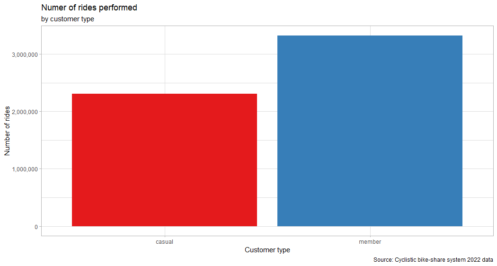<!-- -->

- Rides by customer type by month

``` r
all_2022_data_rides <- all_2022_data %>%
  group_by(customer_type, month) %>% 
  summarise(num_of_rides = n()) %>% 
  arrange(-num_of_rides)

kable(all_2022_data_rides)
```

| customer_type | month | num_of_rides |
|:--------------|:------|-------------:|
| member        | 08    |       424710 |
| member        | 07    |       415244 |
| casual        | 07    |       403433 |
| member        | 09    |       402600 |
| member        | 06    |       398001 |
| casual        | 06    |       366519 |
| casual        | 08    |       356481 |
| member        | 05    |       352428 |
| member        | 10    |       347690 |
| casual        | 09    |       294858 |
| casual        | 05    |       278387 |
| member        | 04    |       243084 |
| member        | 11    |       235645 |
| casual        | 10    |       207678 |
| member        | 03    |       193069 |
| member        | 12    |       135916 |
| casual        | 04    |       125325 |
| casual        | 11    |       100025 |
| member        | 02    |        93417 |
| casual        | 03    |        89196 |
| member        | 01    |        84754 |
| casual        | 12    |        44494 |
| casual        | 02    |        21195 |
| casual        | 01    |        18294 |

``` r
ggplot(all_2022_data_summary, aes(x = customer_type, y = num_of_rides, fill = customer_type)) + 
  geom_col() +
  facet_grid(~month, labeller = labeller(month = c(
    "01" = "January",
    "02" = "February",
    "03" = "March",
    "04" = "April",
    "05" = "May",
    "06" = "June",
    "07" = "July",
    "08" = "August",
    "09" = "September",
    "10" = "October",
    "11" = "November",
    "12" = "December"))) +
  scale_y_continuous(labels = scales::comma) + 
  scale_fill_brewer(palette = 'Accent') +
  theme_light() + 
  theme(axis.text.x = element_blank()) + 
  labs(x = NULL, y = 'Number of rides', title = 'Numer of rides performed by customer type', subtitle = 'by month', caption = 'Source: Cyclistic bike-share system 2022 data') + 
  guides(fill = guide_legend(title = "Customer type"))
```

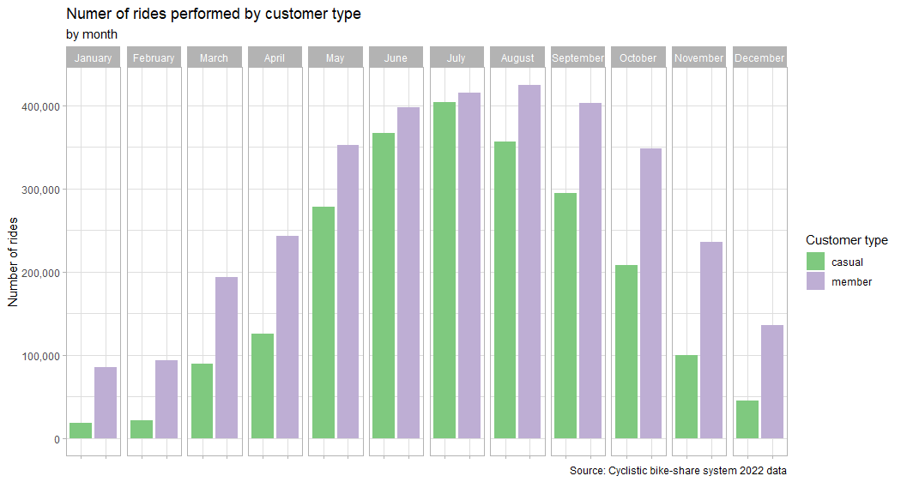<!-- -->


``` r
ggplot(all_2022_data_summary, aes(x = month, y = num_of_rides, fill = customer_type)) + 
  geom_col(show.legend = FALSE) +
  facet_grid(~customer_type) + 
  scale_y_continuous(labels = scales::comma) +
  scale_x_discrete(breaks = c("01", "02", "03", "04", "05", "06", "07", "08", "09", "10", "11", "12"),
                   labels = c("January", "February", "March", "April", "May", "June", "July", "August", "September", "October", "November", "December")) +
  scale_fill_brewer(palette = 'Accent') +
  theme_light() +
  theme(axis.text.x = element_text(angle = 45, hjust = 1)) +
  labs(x = 'Month', y = 'Number of rides', title = 'Numer of rides performed by customer type', subtitle = 'by month', caption = 'Source: Cyclistic bike-share system 2022 data')
```
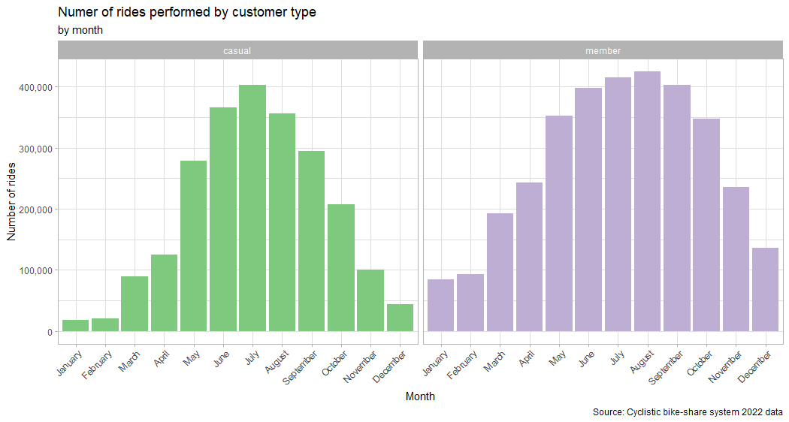<!-- -->

- Rides by customer type by the part of the day

``` r
all_2022_data_calc <- all_2022_data %>% 
  group_by(customer_type, started_at_part_of_day) %>% 
  summarise(num_of_rides = n())
          

kable(all_2022_data_calc)
```

| customer_type | started_at_part_of_day | num_of_rides |
|:--------------|:-----------------------|-------------:|
| casual        | Afternoon              |      1043640 |
| casual        | Evening                |       702471 |
| casual        | Morning                |       454435 |
| casual        | Night                  |       105339 |
| member        | Afternoon              |      1413078 |
| member        | Evening                |       888064 |
| member        | Morning                |       946777 |
| member        | Night                  |        78639 |

``` r
ggplot(all_2022_data_summary, aes(x = customer_type, y = num_of_rides, fill = customer_type)) +
geom_col() +
facet_grid(~factor(started_at_part_of_day, levels = c("Morning", "Afternoon", "Evening", "Night"))) +
scale_fill_brewer(palette = 'Dark2') +
scale_y_continuous(labels = scales::comma) +
theme_light() +
theme(axis.text.x = element_blank()) +
labs(x = NULL, y = 'Number of rides', title = 'Numer of rides performed by customer type', subtitle = 'by part of day when ride started', caption = 'Source: Cyclistic bike-share system 2022 data') +
guides(fill = guide_legend(title = "Customer type"))
```

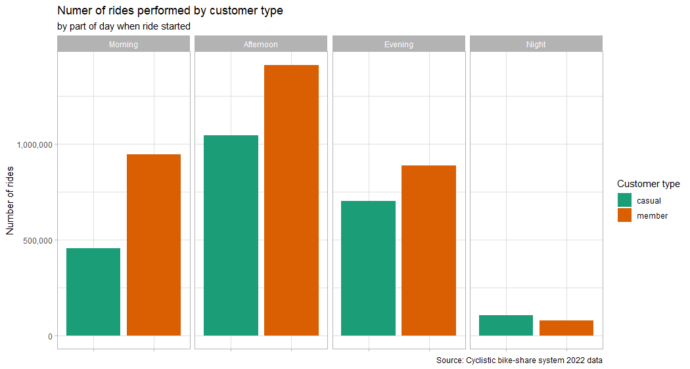<!-- -->

``` r
ggplot(all_2022_data_summary, aes(x = started_at_part_of_day, y = num_of_rides, fill = customer_type)) + 
  geom_col(show.legend = FALSE) +
  facet_grid(~customer_type) +
  scale_fill_brewer(palette = 'Dark2') +
  scale_x_discrete(limits = c("Morning", "Afternoon", "Evening", "Night")) + 
  scale_y_continuous(labels = scales::comma) + 
  theme_light() +
  labs(x = 'Part of day when ride started', y = 'Number of rides', title = 'Numer of rides performed by customer type', subtitle = 'by part of day', caption = 'Source: Cyclistic bike-share system 2022 data')
```

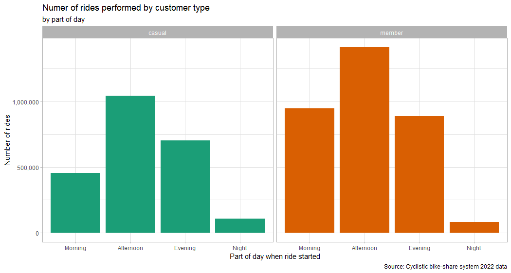<!-- -->

- Rides by customer type by day of the week

``` r
all_2022_data_calc <- all_2022_data %>% 
  group_by(customer_type, start_day_of_week) %>% 
  summarise(num_of_rides = n())
          

kable(all_2022_data_calc)
```

| customer_type | start_day_of_week | num_of_rides |
|:--------------|------------------:|-------------:|
| casual        |                 1 |       275757 |
| casual        |                 2 |       261949 |
| casual        |                 3 |       272538 |
| casual        |                 4 |       307301 |
| casual        |                 5 |       332365 |
| casual        |                 6 |       469872 |
| casual        |                 7 |       386103 |
| member        |                 1 |       470732 |
| member        |                 2 |       515841 |
| member        |                 3 |       520850 |
| member        |                 4 |       529447 |
| member        |                 5 |       464394 |
| member        |                 6 |       440506 |
| member        |                 7 |       384788 |

``` r
ggplot(all_2022_data_summary, aes(x = customer_type, y = num_of_rides, fill = customer_type)) + 
  geom_col() + 
  facet_grid(~start_day_of_week, labeller = labeller(start_day_of_week = c(
    "1" = "Monday",
    "2" = "Tuesday",
    "3" = "Wednesday",
    "4" = "Thursday",
    "5" = "Friday",
    "6" = "Saturday",
    "7" = "Sunday"))) +
  scale_fill_brewer(palette = 'Dark2') + 
  scale_y_continuous(labels = scales::comma) +
  theme_light() +
  theme(axis.text.x = element_blank()) + 
  labs(x = NULL, y = 'Number of rides', title = 'Numer of rides performed by customer type', subtitle = 'by day of week', caption = 'Source: Cyclistic bike-share system 2022 data') +
  guides(fill = guide_legend(title = "Customer type"))
```
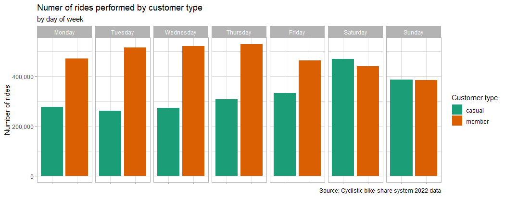<!-- -->


``` r
ggplot(all_2022_data_summary, aes(x = start_day_of_week, y = num_of_rides, fill = customer_type)) + 
  geom_col(show.legend = FALSE) + 
  facet_wrap(~customer_type) +
  scale_fill_brewer(palette = 'Dark2') + 
  scale_x_discrete(limits = c("Monday", "Tuesday", "Wednesday", "Thursday", "Friday", "Saturday", "Sunday")) + 
  scale_y_continuous(labels = scales::comma) +
  theme_light() +
  labs(x = 'Day of week when ride started', y = 'Number of rides', title = 'Numer of rides performed by customer type', subtitle = 'by day of week', caption = 'Source: Cyclistic bike-share system 2022 data') +
  guides(x = guide_axis(angle = 45))
```
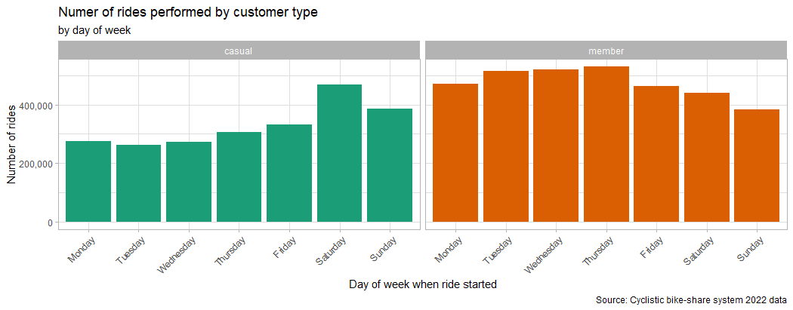<!-- -->


- Mean ride time by customer type

``` r
ggplot(all_2022_data_summary, aes(x = customer_type, y = mean_ride_len, fill = customer_type)) + 
  geom_bar(stat = "summary", fun = "mean", show.legend = FALSE) +
  scale_fill_brewer(palette = 'Set1') +
  theme_light() +
  labs(x = 'Customer type', y = 'Mean ride length [min]', title = 'Mean ride length', subtitle = 'by customer type', caption = 'Source: Cyclistic bike-share system 2022 data')
```
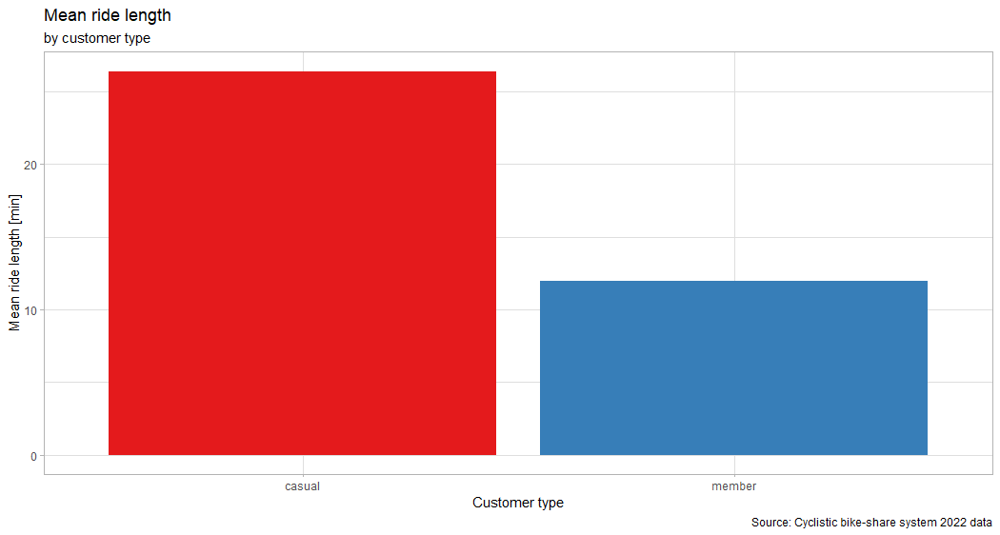<!-- -->

- Mean ride time by customer type by month

``` r
all_2022_data_calc <- all_2022_data %>% 
  group_by(customer_type, month) %>% 
  summarise(mean_ride_len = mean(ride_len))

kable(all_2022_data_calc)
```

| customer_type | month | mean_ride_len |
|:--------------|:------|--------------:|
| casual        | 01    |      17.37859 |
| casual        | 02    |      19.69120 |
| casual        | 03    |      24.13561 |
| casual        | 04    |      23.29981 |
| casual        | 05    |      25.55662 |
| casual        | 06    |      23.41956 |
| casual        | 07    |      23.19093 |
| casual        | 08    |      21.46862 |
| casual        | 09    |      20.02031 |
| casual        | 10    |      18.43743 |
| casual        | 11    |      15.48498 |
| casual        | 12    |      13.49155 |
| member        | 01    |      11.67769 |
| member        | 02    |      11.14663 |
| member        | 03    |      11.80767 |
| member        | 04    |      11.44389 |
| member        | 05    |      13.13695 |
| member        | 06    |      13.72369 |
| member        | 07    |      13.50159 |
| member        | 08    |      13.14946 |
| member        | 09    |      12.69900 |
| member        | 10    |      11.60787 |
| member        | 11    |      10.92742 |
| member        | 12    |      10.42825 |

``` r
ggplot(all_2022_data_summary, aes(x = customer_type, y = mean_ride_len, fill = customer_type)) + 
  geom_bar(stat = "summary", fun = "mean") + 
  facet_grid(~month, labeller = labeller(month = c(
    "01" = "January",
    "02" = "February",
    "03" = "March",
    "04" = "April",
    "05" = "May",
    "06" = "June",
    "07" = "July",
    "08" = "August",
    "09" = "September",
    "10" = "October",
    "11" = "November",
    "12" = "December"))) +
  scale_fill_brewer(palette = 'Accent') +
  theme_light() + 
  theme(axis.text.x = element_blank()) +
  labs(x = NULL, y = 'Mean ride length [min]', title = 'Mean ride length by customer type', subtitle = 'by month', caption = 'Source: Cyclistic bike-share system 2022 data') + 
  guides(fill = guide_legend(title = "Customer type"))
```
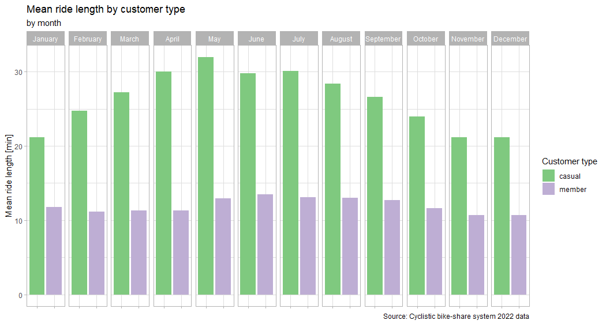<!-- -->

``` r
ggplot(all_2022_data_summary, aes(x = month, y = mean_ride_len, fill = customer_type)) + 
  geom_bar(stat = 'summary', fun = 'mean', show.legend = FALSE) +
  facet_grid(~customer_type) + 
  scale_fill_brewer(palette = 'Accent') +
  scale_x_discrete(breaks = c("01", "02", "03", "04", "05", "06", "07", "08", "09", "10", "11", "12"),
                   labels = c("January", "February", "March", "April", "May", "June", "July", "August", "September", "October", "November", "December")) +
  scale_y_continuous(labels = scales::comma) + 
  theme_light() +
  theme(axis.text.x = element_text(angle = 45, hjust = 1)) +
  labs(x = 'Month', y = 'Mean ride length [min]', title = 'Mean ride length by customer type', subtitle = 'by month', caption = 'Source: Cyclistic bike-share system 2022 data') + 
  guides(fill = guide_legend(title = "Customer type"))
```
<!-- -->

- Mean ride time by customer type by the part of the day

``` r
all_2022_data_calc <- all_2022_data %>% 
  group_by(customer_type, started_at_part_of_day) %>% 
  summarise(mean_ride_len = mean(ride_len))

kable(all_2022_data_calc)
```

| customer_type | started_at_part_of_day | mean_ride_len |
|:--------------|:-----------------------|--------------:|
| casual        | Afternoon              |      23.63782 |
| casual        | Evening                |      19.95018 |
| casual        | Morning                |      21.24334 |
| casual        | Night                  |      19.55094 |
| member        | Afternoon              |      12.85412 |
| member        | Evening                |      12.75722 |
| member        | Morning                |      11.68606 |
| member        | Night                  |      12.19868 |

``` r
ggplot(all_2022_data_summary, aes(x = customer_type, y = mean_ride_len, fill = customer_type)) + 
  geom_bar(stat = "summary", fun = "mean") +
  facet_grid(~factor(started_at_part_of_day, levels = c("Morning", "Afternoon", "Evening", "Night"))) +
  scale_fill_brewer(palette = 'Dark2') +
  theme_light() + 
  theme(axis.text.x = element_blank()) + 
  labs(x = NULL, y = 'Mean ride length [min]', title = 'Mean ride length by customer type', subtitle = 'by part of day when ride started', caption = 'Source: Cyclistic bike-share system 2022 data') + 
  guides(fill = guide_legend(title = "Customer type"))
```

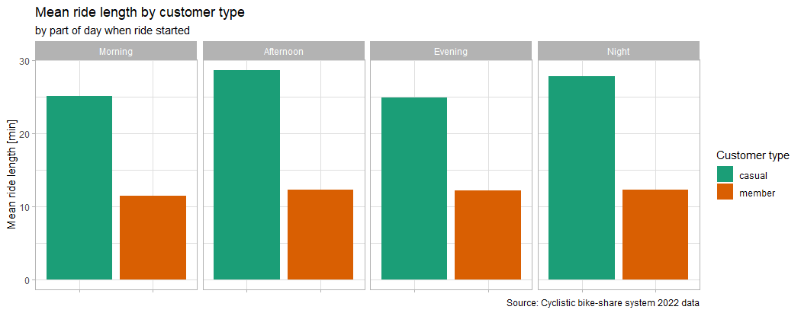<!-- -->

``` r
ggplot(all_2022_data_summary, aes(x = started_at_part_of_day, y = mean_ride_len, fill = customer_type)) + 
  geom_bar(stat = "summary", fun = "mean", show.legend = FALSE) + 
  facet_wrap(~customer_type) +
  scale_fill_brewer(palette = 'Dark2') +
  scale_x_discrete(limits = c('Morning', 'Afternoon', 'Evening', 'Night')) +
  theme_light() +
  labs(x = 'Part of day when ride started', y = 'Mean ride length [min]', title = 'Mean ride length by customer type', subtitle = 'by part of day', caption = 'Source: Cyclistic bike-share system 2022 data')
```

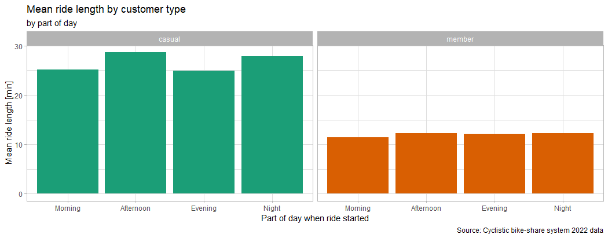<!-- -->

- Mean ride time by customer type by dahy of the week

``` r
all_2022_data_calc <- all_2022_data %>% 
  group_by(customer_type, start_day_of_week) %>% 
  summarise(mean_ride_len = mean(ride_len))

kable(all_2022_data_calc)
```

| customer_type | start_day_of_week | mean_ride_len |
|:--------------|------------------:|--------------:|
| casual        |                 1 |      22.34384 |
| casual        |                 2 |      19.59187 |
| casual        |                 3 |      18.87234 |
| casual        |                 4 |      19.51120 |
| casual        |                 5 |      20.48495 |
| casual        |                 6 |      24.48835 |
| casual        |                 7 |      24.99161 |
| member        |                 1 |      12.06793 |
| member        |                 2 |      11.87201 |
| member        |                 3 |      11.90096 |
| member        |                 4 |      12.07199 |
| member        |                 5 |      12.29508 |
| member        |                 6 |      13.87392 |
| member        |                 7 |      13.77448 |

``` r
ggplot(all_2022_data_summary, aes(x = customer_type, y = mean_ride_len, fill = customer_type)) + 
  geom_bar(stat = "summary", fun = "mean") +
  facet_grid(~start_day_of_week, labeller = labeller(start_day_of_week = c(
    '1' = 'Monday',
    '2' = 'Tuesday',
    '3' = 'Wednesday',
    '4' = 'Thursday',
    '5' = 'Friday',
    '6' = 'Saturday',
    '7' = 'Sunday'))) +
  scale_fill_brewer(palette = 'Dark2') +
  theme_light() + 
  theme(axis.text.x = element_blank()) +
  labs(x = NULL, y = 'Mean ride length [min]', title = 'Mean ride length by customer type', subtitle = 'by day of week', caption = 'Source: Cyclistic bike-share system 2022 data') + 
  guides(fill = guide_legend(title = "Customer type"))
```
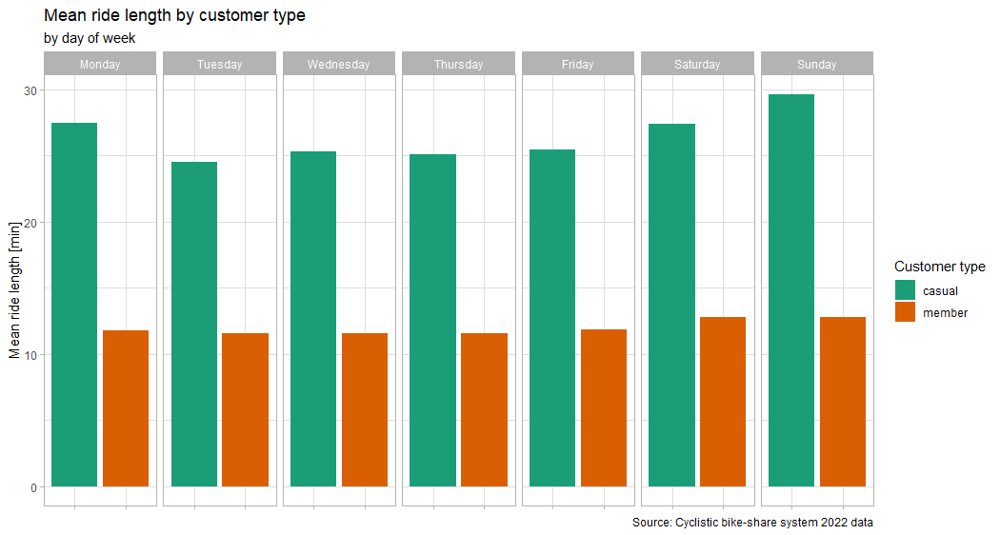<!-- -->

``` r
ggplot(all_2022_data_summary, aes(x = start_day_of_week, y = mean_ride_len, fill = customer_type)) + 
  geom_bar(stat = "summary", fun = "mean", show.legend = FALSE) + 
  facet_grid(~customer_type) +
  scale_fill_brewer(palette = 'Dark2') + 
  scale_x_discrete(limits = c("Monday", "Tuesday", "Wednesday", "Thursday", "Friday", "Saturday", "Sunday")) + 
  theme_light() +
  labs(x = 'Day of week', y = 'Mean ride length [min]', title = 'Mean ride length by customer type', subtitle = 'by day of week', caption = 'Source: Cyclistic bike-share system 2022 data') + 
  guides(x = guide_axis(angle = 45))
```
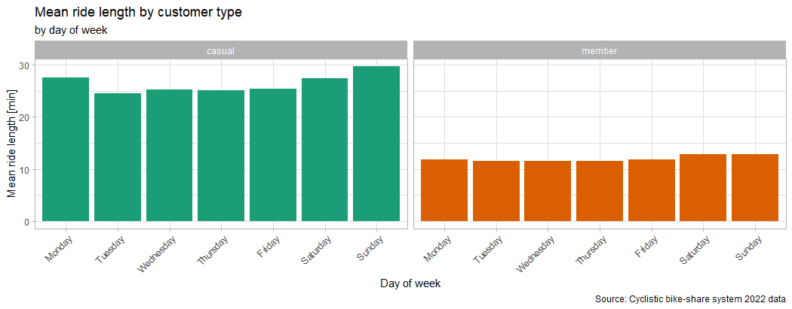<!-- -->

- Mean ride time by customer type by dahy of the week

``` r
ggplot(all_2022_data_summary, aes(x = mean_ride_len, y = num_of_rides, color = customer_type)) + 
  geom_point(stat = "summary", fun = "mean") +
  scale_x_continuous(limits = c(0, 360), breaks = seq(0, 360, by = 60)) +
  theme_light() +
  labs(x = 'Ride length [min]', y = 'Number of rides', title = 'Ride length by number of rides', subtitle = 'per customer type', caption = 'Source: Cyclistic bike-share system 2022 data') +
  guides(title = "Customer type")
```
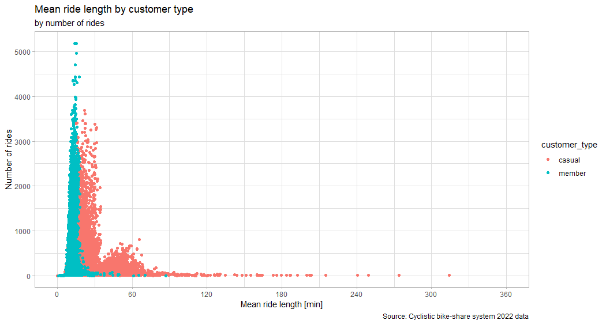<!-- -->

- More detailed view of the second peak of the plot above:

``` r
#1ST CASUAL PEAK IN DETAILS
ggplot(all_2022_data_summary, aes(x = mean_ride_len, y = num_of_rides, color = customer_type)) + 
  geom_point(stat = "summary", fun = "mean") +
  scale_x_continuous(limits = c(20, 90), breaks = seq(0, 90, by = 5)) +
  theme_light() +
  labs(x = 'Mean ride length [min]', y = 'Number of rides', title = 'Mean ride length', subtitle = 'by number of rides', caption = 'Source: Cyclistic bike-share system 2022 data') +
  guides(color = guide_legend(title = "Customer type"))
```
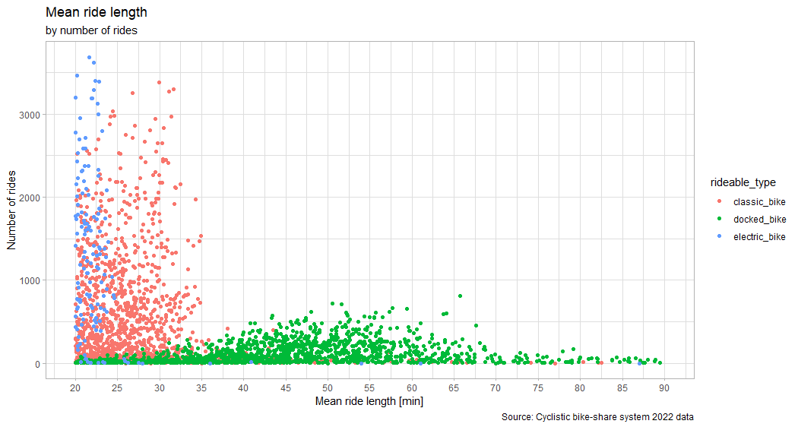<!-- -->

``` r
ggplot(all_2022_data_summary, aes(x = mean_ride_len, y = num_of_rides, color = customer_type)) + 
  geom_point(stat = "summary", fun = "mean") + 
  facet_wrap(~rideable_type) + 
  scale_x_continuous(limits = c(20, 90), breaks = seq(0, 90, by = 20)) +
  labs(x = 'Mean ride length [min]', y = 'Number of rides', title = 'Mean ride length by ridealble type', subtitle = 'by number of rides', caption = 'Source: Cyclistic bike-share system 2022 data')
```
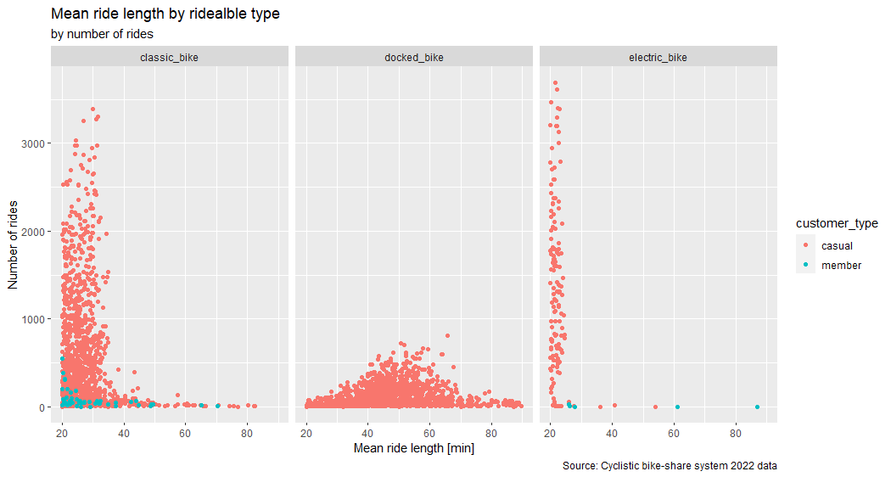<!-- -->

------------------------------------------------------------------------

### FINDING MOST POPULAR STATIONS AND THEIR COMBINATIONS

As mentioned in Prepare phase, start_station_name and end_station_name
are often not provided and for that reason the information about most
popular ‘routes’ does not cover whole dataset.

For finding the number of all rides which could not provide information
about full start and end information I have used querying dataset in
BigQuery SQL:

``` sql
SELECT SUM(num_of_rides) AS num_of_full_ride_info
FROM (SELECT concat(start_station_name, ’ - ’, end_station_name) AS trip_stations, COUNT(*) AS num_of_rides
      FROM `gdapc-capstone-no-1.Cyclistic_2022_rides.all_2022_tripdata`
      WHERE start_station_name IS NOT NULL AND end_station_name IS NOT NULL
      GROUP BY trip_stations
      ORDER BY num_of_rides DESC)

```


|     | num_of_full_ride_info |
|-----|-----------------------|
|     | 4 350 593             |


77,2% of rides data provides data about both start and end station name.

Queries for top 10 most popular station(s):

- as a start:

``` sql
SELECT start_station_name, COUNT(*) AS num_of_rides
FROM `gdapc-capstone-no-1.Cyclistic_2022_rides.all_2022_tripdata`
WHERE start_station_name IS NOT NULL
GROUP BY start_station_name
ORDER BY num_of_rides DESC
LIMIT 10
```


|      | start_station_name                 | num_of_rides |
|------|------------------------------------|--------------|
| 1\.  | Streeter Dr & Grand Ave            | 74669        |
| 2\.  | DuSable Lake Shore Dr & Monroe St  | 40985        |
| 3\.  | DuSable Lake Shore Dr & North Blvd | 39794        |
| 4\.  | Michigan Ave & Oak St              | 39439        |
| 5\.  | Wells St & Concord Ln              | 37325        |
| 6\.  | Clark St & Elm St                  | 34855        |
| 7\.  | Millennium Park                    | 34722        |
| 8\.  | Kingsbury St & Kinzie St           | 33572        |
| 9\.  | Theater on the Lake                | 32802        |
| 10\. | Wells St & Elm St                  | 31332        |

Sum of top 10 start stations query:
``` sql

SELECT SUM(num_of_rides) as rides_sum_start
FROM (SELECT COUNT(*) AS num_of_rides
      FROM `gdapc-capstone-no-1.Cyclistic_2022_rides.all_2022_tripdata`
      WHERE start_station_name IS NOT NULL
      GROUP BY start_station_name
      ORDER BY num_of_rides DESC
      LIMIT 10)
```

|     | rides_sum_start |
|-----|-----------------|
|     | 399495          |

Top ten most popular stations where rides starts generates 399 495 rides
which is about 7,19% of all rides taken.

- as an end:

``` sql
SELECT end_station_name, COUNT(*) AS num_of_rides
FROM `gdapc-capstone-no-1.Cyclistic_2022_rides.all_2022_tripdata`
WHERE end_station_name IS NOT NULL
GROUP BY end_station_name
ORDER BY num_of_rides DESC
LIMIT 10
```

|      | end_station_name                   | num_of_rides |
|------|------------------------------------|--------------|
| 1\.  | Streeter Dr & Grand Ave            | 75103        |
| 2\.  | DuSable Lake Shore Dr & North Blvd | 41980        |
| 3\.  | DuSable Lake Shore Dr & Monroe St  | 39980        |
| 4\.  | Michigan Ave & Oak St              | 39967        |
| 5\.  | Wells St & Concord Ln              | 37282        |
| 6\.  | Millennium Park                    | 35114        |
| 7\.  | Clark St & Elm St                  | 34359        |
| 8\.  | Theater on the Lake                | 32863        |
| 9\.  | Kingsbury St & Kinzie St           | 32256        |
| 10\. | Wells St & Elm St                  | 30218        |

Sum of top 10 end stations query:

``` sql
SELECT SUM(num_of_rides) AS rides_sum_end
FROM (SELECT COUNT(*) AS num_of_rides
      FROM `gdapc-capstone-no-1.Cyclistic_2022_rides.all_2022_tripdata`
      WHERE end_station_name IS NOT NULL
      GROUP BY end_station_name
      ORDER BY num_of_rides DESC
      LIMIT 10)
```


|     | rides_sum_end |
|-----|---------------|
|     | 399122        |

Top ten most popular stations where rides ends generates 399 122 rides
which is about 7,18% of all rides taken.

- as a whole ‘route’:

``` sql
SELECT CONCAT(start_station_name, ’ - ’, end_station_name) AS trip_stations, COUNT (\*) AS num_of_rides
FROM `gdapc-capstone-no-1.Cyclistic_2022_rides.all_2022_tripdata`
WHERE start_station_name IS NOT NULL AND end_station_name IS NOT NULL
GROUP BY trip_stations
ORDER BY num_of_rides DESC
LIMIT 10
```

|      | trip_stations                                                         | num_of_rides |
|------|-----------------------------------------------------------------------|--------------|
| 1\.  | Streeter Dr & Grand Ave - Streeter Dr & Grand Ave                     | 11927        |
| 2\.  | DuSable Lake Shore Dr & Monroe St - DuSable Lake Shore Dr & Monroe St | 7231         |
| 3\.  | Ellis Ave & 60th St - University Ave & 57th St                        | 6797         |
| 4\.  | University Ave & 57th St - Ellis Ave & 60th St                        | 6362         |
| 5\.  | Ellis Ave & 60th St - Ellis Ave & 55th St                             | 6359         |
| 6\.  | Ellis Ave & 55th St - Ellis Ave & 60th St                             | 5716         |
| 7\.  | DuSable Lake Shore Dr & Monroe St - Streeter Dr & Grand Ave           | 5612         |
| 8\.  | Michigan Ave & Oak St - Michigan Ave & Oak St                         | 5397         |
| 9\.  | Millennium Park - Millennium Park                                     | 4338         |
| 10\. | Montrose Harbor - Montrose Harbor                                     | 3547         |

Sum of top 10 trips route query:

``` sql
SELECT SUM(num_of_rides) AS rides_sum_trips
FROM (SELECT concat(start_station_name, ’ - ’, end_station_name) AS trip_stations, COUNT(*) AS num_of_rides
      FROM `gdapc-capstone-no-1.Cyclistic_2022_rides.all_2022_tripdata`
      WHERE start_station_name IS NOT NULL AND end_station_name IS NOT NULL
      GROUP BY trip_stations
      ORDER BY num_of_rides DESC
      LIMIT 10)
```

|     | rides_sum_trips |
|-----|-----------------|
|     | 63286           |

Top ten most popular stations where rides ends generates 63 286 rides
which is about 1,1% of all rides taken.

Having in mind uncompleteness of stations data and that these are not
intended to be used in this case study, I still decided to create a
visualizations based on it. I believe it can give a quick overview of
the most popular areas where rides are taken.

However, there should be none decisions made based on this data without
unifying and replenishing it.

## 5. SHARE PHASE

In addition to plots created in R Studio (included in Analyze phase), data was visualized IN Tableau interactive dashboards:

<html>
    <div class='tableauPlaceholder' id='viz1700402480769' style='position: relative'><noscript><a href='#'></a></noscript><object class='tableauViz'  style='display:none;'><param name='host_url' value='https%3A%2F%2Fpublic.tableau.com%2F' /> <param name='embed_code_version' value='3' /> <param name='site_root' value='' /><param name='name' value='GoogleDACertificateCapstoneProject-Bike-sharecasestudy&#47;GDAPCDashboard' /><param name='tabs' value='no' /><param name='toolbar' value='yes' /><param name='static_image' value='https:&#47;&#47;public.tableau.com&#47;static&#47;images&#47;Go&#47;GoogleDACertificateCapstoneProject-Bike-sharecasestudy&#47;GDAPCDashboard&#47;1.png' /> <param name='animate_transition' value='yes' /><param name='display_static_image' value='yes' /><param name='display_spinner' value='yes' /><param name='display_overlay' value='yes' /><param name='display_count' value='yes' /><param name='language' value='en-US' /></object></div>                <script type='text/javascript'>                    var divElement = document.getElementById('viz1700402480769');                    var vizElement = divElement.getElementsByTagName('object')[0];                    if ( divElement.offsetWidth > 800 ) { vizElement.style.width='1503px';vizElement.style.height='923px';} else if ( divElement.offsetWidth > 500 ) { vizElement.style.width='1503px';vizElement.style.height='923px';} else { vizElement.style.width='100%';vizElement.style.height='2227px';}                     var scriptElement = document.createElement('script');                    scriptElement.src = 'https://public.tableau.com/javascripts/api/viz_v1.js';                    vizElement.parentNode.insertBefore(scriptElement, vizElement);                </script>
</html>

<html>
<div class='tableauPlaceholder' id='viz1700404662946' style='position: relative'><noscript><a href='#'></a></noscript><object class='tableauViz'  style='display:none;'><param name='host_url' value='https%3A%2F%2Fpublic.tableau.com%2F' /> <param name='embed_code_version' value='3' /> <param name='site_root' value='' /><param name='name' value='GoogleDACertificateCapstoneProject-Bike-sharecasestudy_Maps-start&#47;Dashboard1' /><param name='tabs' value='no' /><param name='toolbar' value='yes' /><param name='static_image' value='https:&#47;&#47;public.tableau.com&#47;static&#47;images&#47;Go&#47;GoogleDACertificateCapstoneProject-Bike-sharecasestudy_Maps-start&#47;Dashboard1&#47;1.png' /> <param name='animate_transition' value='yes' /><param name='display_static_image' value='yes' /><param name='display_spinner' value='yes' /><param name='display_overlay' value='yes' /><param name='display_count' value='yes' /><param name='language' value='en-US' /><param name='filter' value='publish=yes' /></object></div>                <script type='text/javascript'>                    var divElement = document.getElementById('viz1700404662946');                    var vizElement = divElement.getElementsByTagName('object')[0];                    if ( divElement.offsetWidth > 800 ) { vizElement.style.width='800px';vizElement.style.height='827px';} else if ( divElement.offsetWidth > 500 ) { vizElement.style.width='800px';vizElement.style.height='827px';} else { vizElement.style.width='100%';vizElement.style.height='977px';}                     var scriptElement = document.createElement('script');                    scriptElement.src = 'https://public.tableau.com/javascripts/api/viz_v1.js';                    vizElement.parentNode.insertBefore(scriptElement, vizElement);                </script>
</html>

<html>
    <div class='tableauPlaceholder' id='viz1700403767888' style='position: relative'><noscript><a href='#'></a></noscript><object class='tableauViz'  style='display:none;'><param name='host_url' value='https%3A%2F%2Fpublic.tableau.com%2F' /> <param name='embed_code_version' value='3' /> <param name='site_root' value='' /><param name='name' value='GoogleDACertificateCapstoneProject-Bike-sharecasestudy_Maps-end&#47;Dashboard12' /><param name='tabs' value='no' /><param name='toolbar' value='yes' /><param name='static_image' value='https:&#47;&#47;public.tableau.com&#47;static&#47;images&#47;Go&#47;GoogleDACertificateCapstoneProject-Bike-sharecasestudy_Maps-end&#47;Dashboard12&#47;1.png' /> <param name='animate_transition' value='yes' /><param name='display_static_image' value='yes' /><param name='display_spinner' value='yes' /><param name='display_overlay' value='yes' /><param name='display_count' value='yes' /><param name='language' value='en-US' /><param name='filter' value='publish=yes' /></object></div>                <script type='text/javascript'>                    var divElement = document.getElementById('viz1700403767888');                    var vizElement = divElement.getElementsByTagName('object')[0];                    if ( divElement.offsetWidth > 800 ) { vizElement.style.width='100%';vizElement.style.height=(divElement.offsetWidth*0.75)+'px';} else if ( divElement.offsetWidth > 500 ) { vizElement.style.width='100%';vizElement.style.height=(divElement.offsetWidth*0.75)+'px';} else { vizElement.style.width='100%';vizElement.style.height='977px';}                     var scriptElement = document.createElement('script');                    scriptElement.src = 'https://public.tableau.com/javascripts/api/viz_v1.js';                    vizElement.parentNode.insertBefore(scriptElement, vizElement);                </script>
</html>
## 6. ACT PHASE

### Analysis findings:

1.  In a year view, member users takes more rides than casual users.
    Casual users – 2 305 006 (which is ~41% of total rides), member
    users – 3 325 841 (~59% of total rides). The smallest casual-member
    rides ratio has been seen in moths with highest total rides – July
    (49:51 ratio), June (48:52 ratio) and August 46:54 ratio). The
    highest proportion difference was observed at the same time in
    months with least total rides number: January (18:82), February
    (18:82) and December (25:75).

2.  Analyzing number of rides from part of the day perspective, as
    mentioned in analyze phase, both member and casual users starts most
    of their rides in the afternoon. While for member users, period with
    second most frequent ride start is morning time, for casual users it
    is evening. In three out of four day parts, number of member’s rides
    is higher than casual ones. The exception is night time when casual
    users rent bikes more often. What more, night is the time when
    electric bikes are rented most frequent by both casual (59,5% of all
    rides) and annual users (59% of all rides).

3.  From a weekday perspective, casual users start to take more rides
    from Wednesday and that number is growing until Saturday when the
    growth is the biggest - over 41% compared to Friday.

    Additionally, from Thursday there is growth of rentals of electric
    bikes share in total number of casual rides. It reach the 45% growth
    rate on Saturday.

    In opposite to casual rides, as the week goes, number of member
    rides starts to drop from Friday and reach the lowest level on
    Sunday which is the only day of the week when casual users perform
    more rides than members (however the difference is very small – 1207
    rides).

4.  While in a year view member users takes more rides than casual ones
    within weekdays (2 500 902 to 1 449 502), this relation is inverted
    on Saturday and Sundays (824 939 to 855 504). Getting more detailed
    view (by months) reveals that casual users takes more weekend rides
    than annual users from May to September.

5.  During weekdays, number of rides from month to month raise in both
    groups from January to June and starts to drop from August until the
    end of the year. Focusing on the same view at weekend rides shows
    consistency in casual rides group – the peak is in July (172 233
    rides): and before it number of rides month-by-month is getting up
    and then it starts to drop in each month. The second group of users
    – members – rent bikes at the weekends very similar but there is
    additional peak in October which is actually the second month with
    most rides at weekends performed by annual users.

6.  Average ride length time differ significant between casual and
    member users across whole year, in month intervals, it is
    respectively 21:52 and 12:29 minutes. Additionally, average ride
    length range for casual group is much wider than for member group:
    3:04 vs 12:25. It means that while casual users ride longer in
    average, their ride time depends strongly on the month when the ride
    is taken. On the other hand, member users take shorter rides but the
    month when the ride is taken does not impact on the ride length
    strongly.

7.  In both groups average ride time grows from Thursday to Sunday but
    dynamic of this change is different. Speed of growth of average ride
    length is bigger in casual users group (from 18:52 to 24:59 min)
    than in member users group (from 11:54 to 13:47 min).

8.  For both – casual and member users – average ride time raise at the
    weekends at every part of the day.

9.  Investigating types of chosen bikes by each group, first thing to
    notice is that only casual riders use assistive type bikes. In a
    year it is about 3% of all rentals (about 8% in casual users group).
    Month-by-month analysis shows that those types of bikes are chosen
    most commonly from March to May and the number of those rents
    increase on the weekends. Months with least docked bikes rentals
    are: January, November and December.

10. In a whole year view, casual users favourite bike type are electric
    ones (54% of all rentals) and member users tend to choose classic
    bikes more often (52% of all rentals). More detailed,
    by-day-of-the-week view, shows that electric bikes rides raise in
    both groups at the weekends.

11. Relation between ride length and rides taken for each rideable type:

    - Classic bikes: member users takes more rides but they are shorter
      then casual users rides which are less numerous.

    - Electric bikes: number of rides for member and casual users are
      similar (1 625 024 to 1 245 120) but they differ in length.

    - Docked bikes: as mentioned before, only casual users takes rides
      by assisted bikes. As analyze showed, those types of bikes are
      chosen for longer rides – the most frequent ride time for this
      option is between 35 and 70 minutes.

### Recommendations based on the analysis:

1.  
2.  
3.  
4.  
5.  
